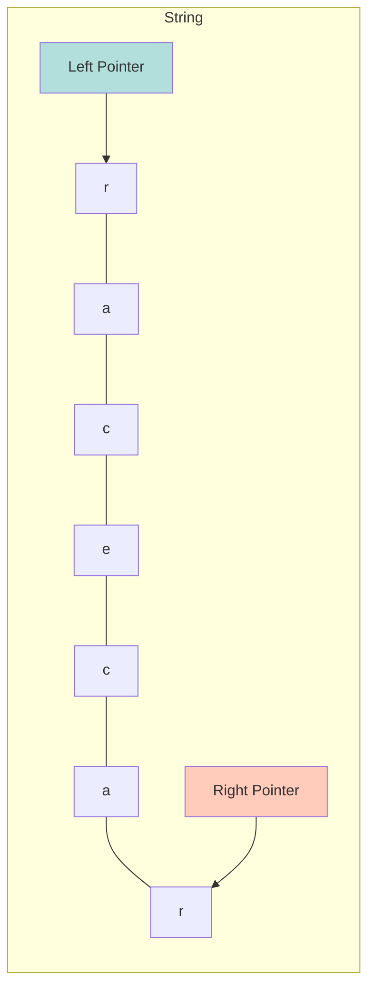
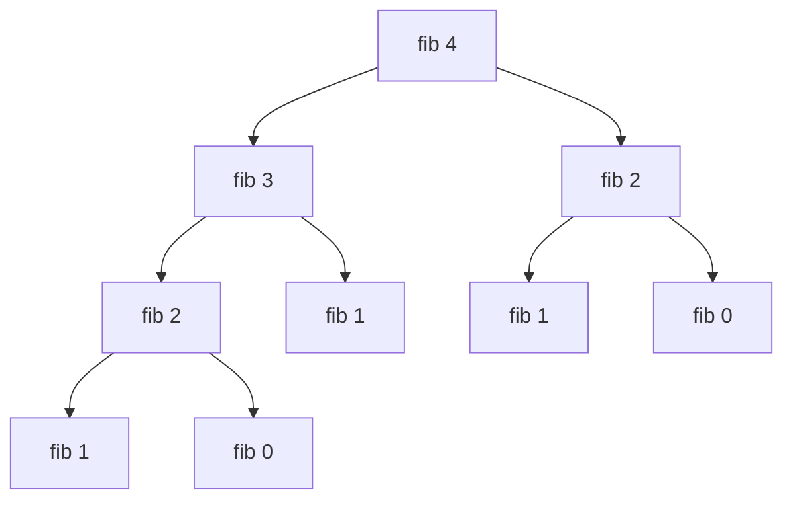

# 🧩 Common Coding Patterns (Must Know)

These are high-probability questions for SDE-1 rounds. They test your grasp of basic data structures and algorithmic thinking.

## 1. Frequency Counter Pattern (Valid Anagram)
**Best for:** Comparing two arrays/strings to see if they have the same contents/frequency of elements. Avoids nested loops ($O(n^2)$) in favor of $O(n)$.

### Example: Valid Anagram
**Input:** `"anagram"`, `"nagaram"` -> `true`

```javascript
function isAnagram(s, t) {
    if (s.length !== t.length) return false;

    const map = {};

    for (let char of s) {
        map[char] = (map[char] || 0) + 1;
    }

    for (let char of t) {
        if (!map[char]) return false; // Char not found or count is 0
        map[char]--;
    }

    return true;
}
console.log("Anagram:", isAnagram("anagram", "nagaram")); // true
```

### 🔗 Practice Questions
- [Valid Anagram (LeetCode)](https://leetcode.com/problems/valid-anagram/)
- [Same Frequency (GeeksforGeeks)](https://www.geeksforgeeks.org/check-if-two-arrays-are-equal-or-not/)

---

## 2. Two Pointer Pattern (Valid Palindrome)
**Best for:** Searching for pairs in a sorted array or checking palindrome properties.

### Diagram: Palindrome Check


### Example: Valid Palindrome
**Input:** `"A man, a plan, a canal: Panama"` -> `true`

```javascript
function isPalindrome(s) {
    // Regex to remove non-alphanumeric and convert to lower case
    s = s.replace(/[^a-zA-Z0-9]/g, '').toLowerCase();

    let left = 0;
    let right = s.length - 1;

    while (left < right) {
        if (s[left] !== s[right]) return false;
        left++;
        right--;
    }
    return true;
}
console.log("Palindrome:", isPalindrome("A man, a plan, a canal: Panama")); // true
```

### 🔗 Practice Questions
- [Valid Palindrome (LeetCode)](https://leetcode.com/problems/valid-palindrome/)

---

## 3. Recursion vs Iteration (Fibonacci)
**Best for:** Understanding the trade-offs between stack usage (recursion) and performance (iteration).

### Diagram: Recursion Tree (Fibonacci)
Visualizing `fib(4)`:


### Example: Fibonacci Sequence
**Sequence:** 0, 1, 1, 2, 3, 5, 8...

```javascript
// Iterative (Better for performance O(n))
function fibIterative(n) {
    if (n < 2) return n;
    let a = 0, b = 1;
    for (let i = 2; i <= n; i++) {
        let temp = a + b;
        a = b;
        b = temp;
    }
    return b;
}

// Recursive (Good for theory O(2^n))
function fibRecursive(n) {
    if (n < 2) return n;
    return fibRecursive(n - 1) + fibRecursive(n - 2);
}

console.log("Fib(6):", fibIterative(6)); // 8
```

### 🔗 Practice Questions
- [Climbing Stairs (LeetCode)](https://leetcode.com/problems/climbing-stairs/) (Similar logic to Fibonacci)

---

## 4. Flatten Nested Array (Recursion)
**Best for:** Handling deeply nested structures (arrays, objects, DOM trees).

### Example: Flatten
**Input:** `[1, [2, [3, 4], 5]]` -> `[1, 2, 3, 4, 5]`

```javascript
function flatten(arr) {
    let result = [];

    for (let item of arr) {
        if (Array.isArray(item)) {
            // If item is array, recurse and push spread results
            result.push(...flatten(item));
        } else {
            result.push(item);
        }
    }
    return result;
}

// Using built-in (Interviewers might ask to implement polyfill above)
// const flat = arr.flat(Infinity);

console.log("Flatten:", flatten([1, [2, [3, 4], 5]])); 
```

### 🔗 Practice Questions
- [Flatten Deeply Nested Array (LeetCode)](https://leetcode.com/problems/flatten-deeply-nested-array/)
