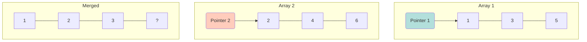

# 🚀 Advanced Coding Patterns (SDE-1)

This guide covers slightly harder but very common coding patterns asked in SDE-1 interviews. Mastering these will give you a significant edge.

## 1. Sliding Window Pattern
**Best for:** Problems involving arrays or strings where you need to find a subarray or substring that satisfies a condition (e.g., max sum, longest substring).

### Concept
Instead of re-calculating the sum/condition for every subarray (which is $O(n^2)$), we "slide" a window of size `k` across the array. We add the new element entering the window and remove the element leaving it.

```mermaid
graph LR
    subgraph Array
    A[2] --- B[1] --- C[5] --- D[1] --- E[3] --- F[2]
    end
    
    subgraph Window 1 (Sum=8)
    A --- B --- C
    end
    
    subgraph Window 2 (Sum=7)
    B --- C --- D
    end
    
    style Window 1 fill:#e1f5fe,stroke:#01579b
    style Window 2 fill:#fff9c4,stroke:#fbc02d
```

### Example: Max Sum Subarray of size K
**Input:** `[2, 1, 5, 1, 3, 2]`, `k=3`
**Output:** `9` (5+1+3)

```javascript
function maxSubarraySum(arr, k) {
    if (arr.length < k) return null;

    let maxSum = 0;
    let tempSum = 0;

    // Calculate sum of first window
    for (let i = 0; i < k; i++) {
        maxSum += arr[i];
    }

    tempSum = maxSum;

    // Slide the window
    for (let i = k; i < arr.length; i++) {
        // Subtract element leaving the window, add element entering
        tempSum = tempSum - arr[i - k] + arr[i];
        maxSum = Math.max(maxSum, tempSum);
    }

    return maxSum;
}
console.log("Max Subarray Sum:", maxSubarraySum([2, 1, 5, 1, 3, 2], 3));
```

### 🔗 Practice Questions
- [Maximum Sum Subarray of Size K (GeeksforGeeks)](https://www.geeksforgeeks.org/find-maximum-sum-subarray-of-size-k/)
- [Longest Substring Without Repeating Characters (LeetCode)](https://leetcode.com/problems/longest-substring-without-repeating-characters/)

---

## 2. Two Pointers (Merge Sorted Arrays)
**Best for:** Sorted arrays or lists where you need to find pairs or merge data.

### Concept
Use two pointers, usually starting at different positions (e.g., beginning of two arrays, or start and end of one array), and move them based on a condition.



### Example: Merge Two Sorted Arrays
**Input:** `[1, 3, 5]`, `[2, 4, 6]`
**Output:** `[1, 2, 3, 4, 5, 6]`

```javascript
function mergeSortedArrays(arr1, arr2) {
    let merged = [];
    let i = 0;
    let j = 0;

    while (i < arr1.length && j < arr2.length) {
        if (arr1[i] < arr2[j]) {
            merged.push(arr1[i]);
            i++;
        } else {
            merged.push(arr2[j]);
            j++;
        }
    }

    // Push remaining elements
    while (i < arr1.length) {
        merged.push(arr1[i]);
        i++;
    }
    while (j < arr2.length) {
        merged.push(arr2[j]);
        j++;
    }

    return merged;
}
console.log("Merged:", mergeSortedArrays([1, 3, 5], [2, 4, 6]));
```

### 🔗 Practice Questions
- [Merge Sorted Array (LeetCode)](https://leetcode.com/problems/merge-sorted-array/)
- [Two Sum II - Input Array Is Sorted (LeetCode)](https://leetcode.com/problems/two-sum-ii-input-array-is-sorted/)

---

## 3. Stack Pattern (Valid Parentheses)
**Best for:** Parsing, balancing symbols, or problems requiring "Last In, First Out" (LIFO) processing.

### Example: Valid Parentheses
**Input:** `"{[]}"` -> `true`, `"{[}]"` -> `false`

```javascript
function isValidParentheses(s) {
    const stack = [];
    const map = {
        '(': ')',
        '{': '}',
        '[': ']'
    };

    for (let char of s) {
        if (map[char]) {
            // If open bracket, push corresponding close bracket to stack
            stack.push(map[char]);
        } else {
            // If close bracket, check if it matches top of stack
            if (stack.pop() !== char) return false;
        }
    }

    return stack.length === 0;
}
console.log("Valid Parentheses:", isValidParentheses("{[]}")); // true
```

### 🔗 Practice Questions
- [Valid Parentheses (LeetCode)](https://leetcode.com/problems/valid-parentheses/)
- [Min Stack (LeetCode)](https://leetcode.com/problems/min-stack/)

---

## 4. Hash Map Pattern (Group Anagrams)
**Best for:** Fast lookups, counting frequencies, or grouping items.

### Example: Group Anagrams
**Input:** `["eat", "tea", "tan", "ate", "nat", "bat"]`
**Output:** `[["eat","tea","ate"], ["tan","nat"], ["bat"]]`

```javascript
function groupAnagrams(strs) {
    const map = {};

    for (let str of strs) {
        // Sort string to use as key: "eat" -> "aet"
        const key = str.split('').sort().join('');

        if (!map[key]) {
            map[key] = [];
        }
        map[key].push(str);
    }

    return Object.values(map);
}
console.log("Group Anagrams:", groupAnagrams(["eat", "tea", "tan", "ate", "nat", "bat"]));
```

### 🔗 Practice Questions
- [Group Anagrams (LeetCode)](https://leetcode.com/problems/group-anagrams/)
- [Two Sum (LeetCode)](https://leetcode.com/problems/two-sum/)

---

## 5. Binary Search (Bonus SDE-1 Topic)
**Best for:** Searching in a **sorted** array. $O(\log n)$ complexity.

### Example: Basic Binary Search
```javascript
function binarySearch(arr, target) {
    let left = 0;
    let right = arr.length - 1;

    while (left <= right) {
        const mid = Math.floor((left + right) / 2);
        if (arr[mid] === target) return mid;
        if (arr[mid] < target) left = mid + 1;
        else right = mid - 1;
    }
    return -1;
}
```
