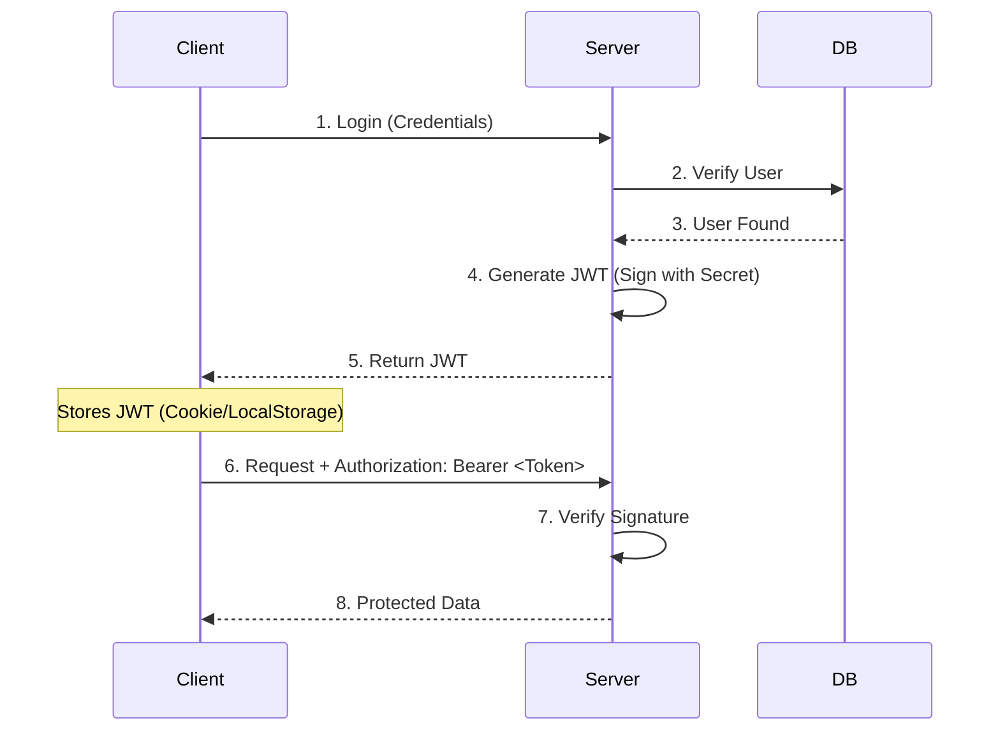

# 🌐 Full Stack Interview Concepts

This guide covers essential concepts for a Full Stack SDE-1 role, bridging the gap between Frontend and Backend.

## 1. Authentication & Authorization
**Q: Difference between Authentication (AuthN) and Authorization (AuthZ)?**
- **AuthN:** Verifying **WHO** you are (Login, Password, OTP).
- **AuthZ:** Verifying **WHAT** you can do (Admin, User, Read-only).

### JWT vs Session-Based Auth
| Feature | Session Based | Token Based (JWT) |
| :--- | :--- | :--- |
| **State** | Stateful (Stored on Server) | Stateless (Stored on Client) |
| **Storage** | Cookie | LocalStorage / Cookie |
| **Scalability** | Harder (Needs Sync/Sticky Sessions) | Easier (Self-contained) |
| **Revocation** | Easy (Delete session) | Hard (Need Blocklist/Expiry) |

### Diagram: JWT Authentication Flow


---

## 2. REST API Design
**REST (Representational State Transfer)** is an architectural style for designing networked applications.

### HTTP Methods Cheat Sheet
- **GET:** Fetch data. **Idempotent** (Safe to call multiple times).
- **POST:** Create new resource. **Not Idempotent**.
- **PUT:** Update/Replace **entire** resource. **Idempotent**.
- **PATCH:** Update **partial** resource. **Not Idempotent** (usually).
- **DELETE:** Remove resource. **Idempotent**.

### HTTP Status Codes
- **2xx Success:** `200 OK`, `201 Created`
- **3xx Redirection:** `301 Moved Permanently`, `304 Not Modified`
- **4xx Client Error:** `400 Bad Request`, `401 Unauthorized` (Not Logged In), `403 Forbidden` (No Permission), `404 Not Found`
- **5xx Server Error:** `500 Internal Server Error`, `502 Bad Gateway`

---

## 3. Database Concepts (SQL vs NoSQL)

| Feature | SQL (Relational) | NoSQL (Non-Relational) |
| :--- | :--- | :--- |
| **Examples** | MySQL, PostgreSQL, Oracle | MongoDB, Redis, Cassandra |
| **Structure** | Tables, Rows, Columns | Documents, Key-Value, Graphs |
| **Schema** | Strict (Pre-defined) | Flexible (Dynamic) |
| **Relations** | Complex (Joins) | Denormalized (Embedded) |
| **Scaling** | Vertical (Bigger Server) | Horizontal (More Servers/Sharding) |
| **ACID** | Strong support | Eventual Consistency (BASE) |

---

## 4. Web Security Basics
Security is a critical part of SDE-1 interviews.

### 1. CORS (Cross-Origin Resource Sharing)
**Problem:** Browsers block requests from Domain A (e.g., `localhost:3000`) to Domain B (e.g., `api.server.com`) for security.
**Solution:** The server must send specific headers to allow the browser to accept the response.
- `Access-Control-Allow-Origin: *` (or specific domain)
- `Access-Control-Allow-Methods: GET, POST`

### 2. XSS (Cross-Site Scripting)
**Attack:** Injecting malicious JS scripts into a webpage (e.g., in a comment section) that steal cookies/tokens.
**Prevention:** 
- Sanitize all user inputs.
- Use frameworks like React (which auto-escapes content).
- Implement **Content Security Policy (CSP)**.

### 3. CSRF (Cross-Site Request Forgery)
**Attack:** Tricking a logged-in user into performing an unwanted action (e.g., clicking a link that deletes their account).
**Prevention:** 
- Use **CSRF Tokens** (hidden fields in forms).
- Use `SameSite` attribute for Cookies.

---

## 5. System Design Basics (Low Level)
**Q: How to handle file uploads?**
- Use `multipart/form-data` encoding.
- In Node.js, use `multer` middleware.
- **Best Practice:** Don't store files in the DB. Store them in Object Storage (AWS S3, Cloudinary) and save the **URL** in the database.

**Q: How to scale a Node.js app?**
1. **Clustering:** Use the `cluster` module to fork processes for each CPU core (Node is single-threaded).
2. **Load Balancing:** Use Nginx or Cloud Load Balancers to distribute traffic.
3. **Caching:** Use Redis to cache expensive DB queries.
4. **Database Indexing:** Add indexes to columns you search frequently to speed up reads.

---

## 6. JavaScript Fundamentals (Must Know)

### Closures
A closure is when a function "remembers" variables from its outer scope.

```javascript
function createCounter() {
  let count = 0; // Private variable
  
  return {
    increment: () => ++count,
    decrement: () => --count,
    getCount: () => count
  };
}

const counter = createCounter();
console.log(counter.increment()); // 1
console.log(counter.increment()); // 2
console.log(counter.getCount());  // 2
// console.log(count); // ReferenceError - private!
```

**Use cases:**
- Data encapsulation/privacy
- Factory functions
- Event handlers
- Module pattern

---

### Debouncing vs Throttling

**Debouncing:** Delays execution until user stops triggering for N ms.
```javascript
function debounce(func, delay) {
  let timeoutId;
  return function(...args) {
    clearTimeout(timeoutId);
    timeoutId = setTimeout(() => func.apply(this, args), delay);
  };
}

// Use: Search bar (wait until user stops typing)
const search = debounce((query) => {
  fetch(`/api/search?q=${query}`);
}, 300);

input.addEventListener('input', (e) => search(e.target.value));
```

**Throttling:** Execute at most once per N ms.
```javascript
function throttle(func, limit) {
  let inThrottle;
  return function(...args) {
    if (!inThrottle) {
      func.apply(this, args);
      inThrottle = true;
      setTimeout(() => inThrottle = false, limit);
    }
  };
}

// Use: Scroll events (limit frequency)
const handleScroll = throttle(() => {
  console.log('Scroll:', window.scrollY);
}, 1000);

window.addEventListener('scroll', handleScroll);
```

---

### `call`, `apply`, and `bind`

All three set the `this` value of a function.

```javascript
const person = { name: 'Alice' };

function greet(greeting, punctuation) {
  console.log(`${greeting}, ${this.name}${punctuation}`);
}

// call: Invoke immediately, args individually
greet.call(person, 'Hello', '!'); // "Hello, Alice!"

// apply: Invoke immediately, args as array
greet.apply(person, ['Hi', '.']); // "Hi, Alice."

// bind: Returns new function (not invoked)
const greetAlice = greet.bind(person);
greetAlice('Hey', '!!'); // "Hey, Alice!!"

// Partial application
const sayHello = greet.bind(person, 'Hello');
sayHello('!!!'); // "Hello, Alice!!!"
```

**Key Difference:**
- `call/apply`: Execute immediately
- `bind`: Returns bound function

