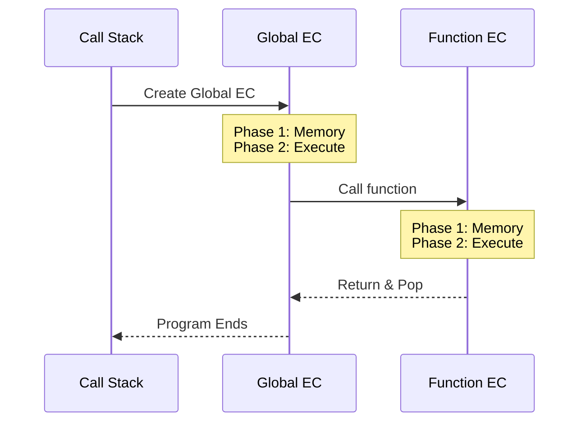
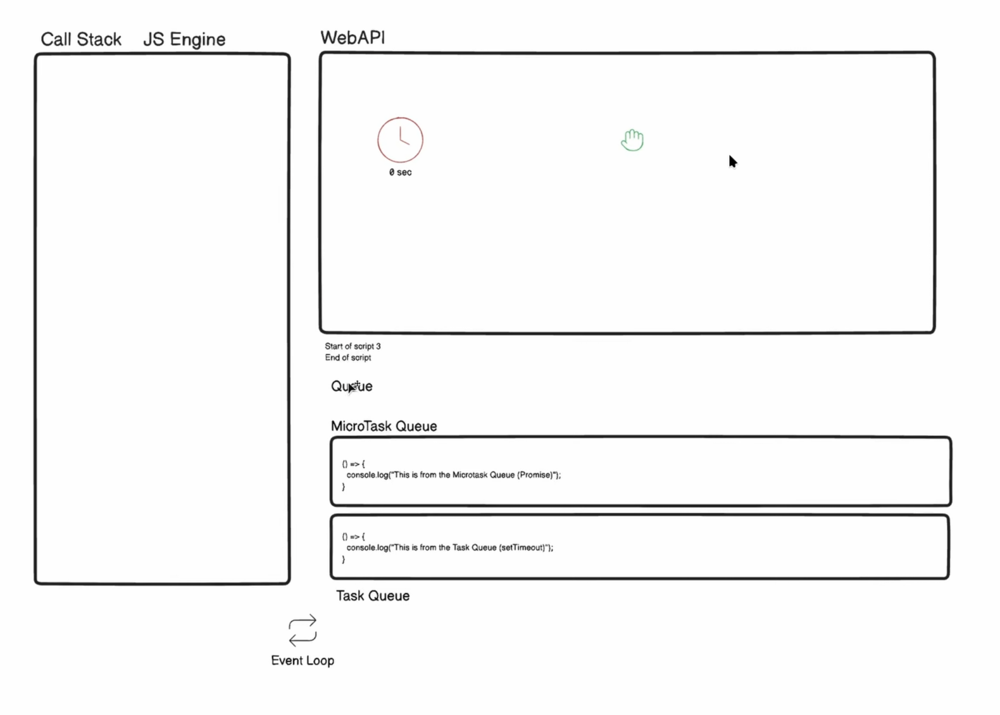
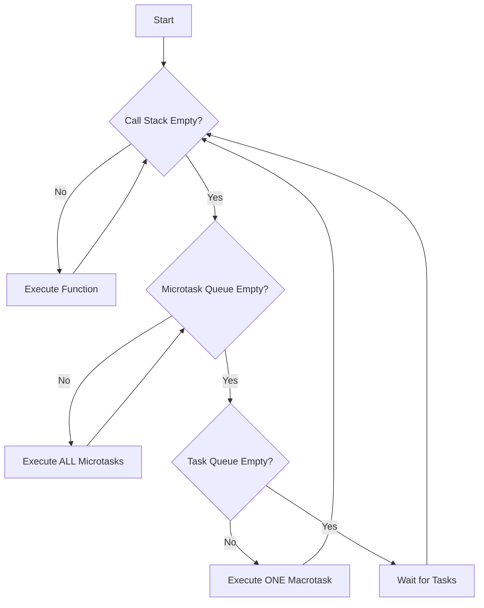
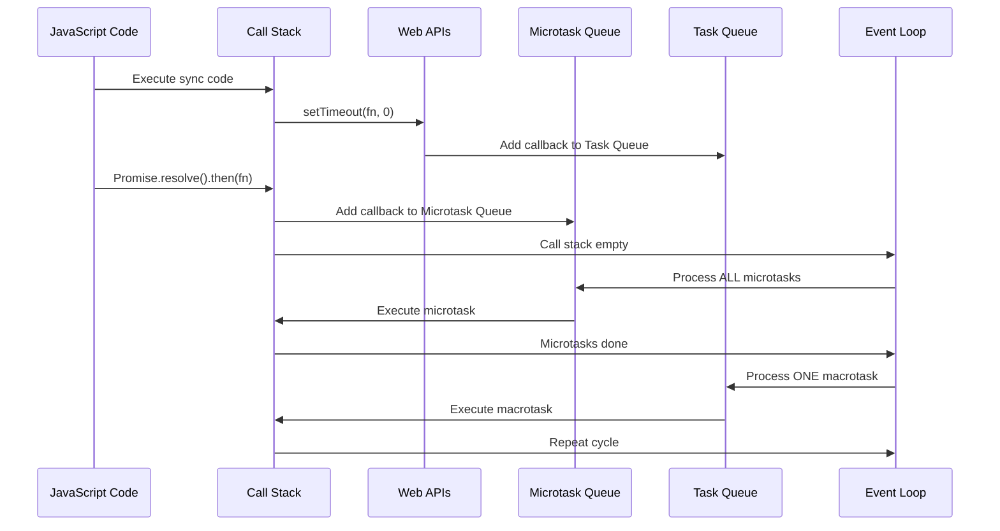

# 🧠 JavaScript Fundamentals

Essential JavaScript concepts for interview preparation.

---

## 1. Hoisting

**What is Hoisting?**
JavaScript's default behavior of moving declarations to the top of the current scope (function or global) during the compilation phase.

### Variable Hoisting

**`var` - Hoisted and initialized with `undefined`:**
```javascript
console.log(x); // undefined (not ReferenceError!)
var x = 5;
console.log(x); // 5

// What actually happens:
// var x;           // Declaration hoisted
// console.log(x);  // undefined
// x = 5;           // Assignment stays in place
```

**`let` and `const` - Hoisted but NOT initialized:**
```javascript
console.log(y); // ReferenceError: Cannot access 'y' before initialization
let y = 10;

console.log(z); // ReferenceError: Cannot access 'z' before initialization
const z = 20;
```

### Function Hoisting

**Function Declarations - Fully hoisted:**
```javascript
greet(); // "Hello!" - Works fine!

function greet() {
  console.log("Hello!");
}
```

**Function Expressions - NOT hoisted:**
```javascript
sayHi(); // TypeError: sayHi is not a function

var sayHi = function() {
  console.log("Hi!");
};

// What actually happens:
// var sayHi;           // Declaration hoisted (undefined)
// sayHi();             // Calling undefined() throws TypeError
// sayHi = function(){} // Assignment
```

**Arrow Functions - NOT hoisted:**
```javascript
hello(); // ReferenceError

const hello = () => console.log("Hello");
```

---

## 2. Temporal Dead Zone (TDZ)

**What is TDZ?**
The time between entering a scope and the variable being declared where you **cannot access** the variable.

```javascript
// TDZ starts here for 'x'
console.log(x); // ReferenceError: Cannot access 'x' before initialization

let x = 10; // TDZ ends here
console.log(x); // 10 - Now accessible
```

**Why does TDZ exist?**
- Catches bugs early (accessing variables before initialization)
- Makes code more predictable
- Prevents temporal coupling issues

**TDZ Example with `const`:**
```javascript
{
  // TDZ for 'name' starts
  console.log(name); // ReferenceError
  
  const name = "Alice"; // TDZ ends
  console.log(name); // "Alice"
}
```

**TDZ in function parameters:**
```javascript
function example(a = b, b = 2) {
  // ReferenceError: Cannot access 'b' before initialization
  // 'b' is in TDZ when used as default for 'a'
}
example();

// Fix: Reorder parameters
function fixed(b = 2, a = b) {
  console.log(a, b); // Works fine
}
fixed(); // 2, 2
```

**Key Point:** `var` has NO TDZ because it's initialized with `undefined` during hoisting.

---

## 3. Global Execution Context

**What is Execution Context?**  
Environment where JavaScript code is evaluated and executed. Contains:
1. **Variable Environment** (variables, functions)
2. **Scope Chain** (access to outer scopes)
3. **`this` binding**

---

### Types of Execution Contexts

| Type | Created When | Count | Key Points |
|------|-------------|-------|------------|
| **Global (GEC)** | Script starts | Only ONE per program | Creates global object (`window`/`global`), sets `this` |
| **Function (FEC)** | Function invoked | Many (one per call) | Local variables, arguments, own `this` |
| **Eval** | `eval()` called | Rare | Avoid using |

---

### Two-Phase Execution ⚡

Every execution context has **2 distinct phases**:

#### **Phase 1: Memory Creation (Hoisting)**
JavaScript scans code **before** execution:

| Declaration | Memory Allocation |
|------------|-------------------|
| `var` | `undefined` |
| `let`/`const` | `<uninitialized>` (TDZ starts) |
| Function Declaration | Entire function code |
| Function Expression | Only variable declaration |

#### **Phase 2: Code Execution**
- Executes line by line
- Assigns actual values
- Creates new execution contexts for function calls

---

### Example: Two Phases in Action

```javascript
console.log(x); // undefined (var hoisted)
console.log(y); // ReferenceError (TDZ)

var x = 10;
let y = 20;

function greet() {
  return "Hello";
}
console.log(greet()); // "Hello"
```

**Phase 1 - Memory:**
```javascript
{
  x: undefined,
  y: <uninitialized>, // TDZ
  greet: function greet() { return "Hello"; }
}
```

**Phase 2 - Execution:**
```
Line 1: console.log(x) → undefined
Line 2: console.log(y) → ReferenceError (TDZ)
Line 4: x = 10
Line 5: y = 20 (TDZ ends)
Line 7-9: Function already in memory
Line 10: greet() → Create FEC → Execute → Return "Hello"
```

---

### Call Stack Visualization

```javascript
var name = "Global";

function outer() {
  var name = "Outer";
  
  function inner() {
    var name = "Inner";
    console.log(name); // "Inner"
  }
  
  inner();
  console.log(name); // "Outer"
}

outer();
console.log(name); // "Global"

// Call Stack:
// 3. inner() EC ← Top
// 2. outer() EC
// 1. Global EC ← Bottom
```

**Stack Flow:**


---

### Execution Context vs Scope

| Concept | Meaning | Example |
|---------|---------|---------|
| **Execution Context** | WHERE code is executed (environment) | Global EC, Function EC |
| **Scope** | WHICH variables you can ACCESS | Global scope, Function scope, Block scope |

```javascript
var x = 10; // Global scope

function test() {
  var y = 20; // Function scope
  console.log(x); // 10 (access global)
  console.log(y); // 20 (access local)
}

test();
console.log(y); // ReferenceError (y not in global scope)
```

---

### Interview Key Points 🎯

**Q: What happens during execution context creation?**
- Phase 1: Memory allocation (hoisting)
- Phase 2: Line-by-line execution

**Q: Difference between GEC and FEC?**
- GEC: One per program, creates global object, sets `this` to global
- FEC: One per function call, has arguments, local variables

**Q: Why does `var` return `undefined` when hoisted?**
- `var` is initialized with `undefined` in Phase 1
- `let`/`const` are NOT initialized (TDZ starts)

---

## Quick Reference Table

| Concept | `var` | `let`/`const` |
|---------|-------|---------------|
| **Hoisting** | ✅ Hoisted + initialized (`undefined`) | ✅ Hoisted but NOT initialized |
| **TDZ** | ❌ No TDZ | ✅ Has TDZ |
| **Re-declaration** | ✅ Allowed | ❌ Not allowed |
| **Scope** | Function scope | Block scope |
| **Global Object** | Becomes property of `window` | Does NOT become property of `window` |

---

## Common Interview Questions

**Q1: What will this code output?**
```javascript
console.log(a);
var a = 5;
console.log(a);

// Answer: undefined, 5
```

**Q2: What will this code output?**
```javascript
greet();

function greet() {
  console.log("Hello");
}

var greet = function() {
  console.log("Hi");
};

// Answer: "Hello" (function declaration is hoisted, assignment happens later)
```

**Q3: Explain the error:**
```javascript
let x = 10;
{
  console.log(x); // ReferenceError
  let x = 20;
}

// Answer: TDZ - inner 'x' is hoisted to block scope but not initialized yet
```

---

## 4. Event Loop, Call Stack, Task Queue & Microtask Queue

### Understanding JavaScript's Asynchronous Execution

JavaScript is **single-threaded** but handles async operations via the **Event Loop** mechanism.



---

### Core Components

#### 1. Call Stack
- **LIFO (Last In, First Out)** structure tracking function execution
- Functions are **pushed** when called, **popped** when they return

#### 2. Web APIs
- Browser-provided APIs handling async operations: `setTimeout`, `fetch`, DOM events, Promises

#### 3. Task Queue (Macrotask Queue)
- **FIFO (First In, First Out)** structure  
- Contains: `setTimeout`, `setInterval`, I/O operations

#### 4. Microtask Queue
- **Higher priority** than Task Queue
- Contains: `Promise.then()`, `async/await`, `queueMicrotask()`

---

### Event Loop Flow

**Step-by-Step Execution:**
1. Execute **synchronous code** (Call Stack)
2. When Call Stack is **empty**, execute **ALL microtasks**
3. Execute **ONE macrotask**
4. **Repeat** from step 2



---

### Priority Order

**🏆 Execution Priority (Highest → Lowest):**
1. **Synchronous Code** (Call Stack)
2. **Microtasks** (Promises, async/await)
3. **Macrotasks** (setTimeout, setInterval)

> **Key Rule:** ALL microtasks execute before the next macrotask

---

### Essential Example: Promises vs setTimeout

```javascript
console.log("1: Sync Start");

setTimeout(() => console.log("2: Timeout 1"), 0);

Promise.resolve()
  .then(() => console.log("3: Promise 1"))
  .then(() => console.log("4: Promise 2"));

setTimeout(() => console.log("5: Timeout 2"), 0);

Promise.resolve().then(() => console.log("6: Promise 3"));

console.log("7: Sync End");

// Output:
// 1: Sync Start
// 7: Sync End
// 3: Promise 1
// 4: Promise 2
// 6: Promise 3
// 2: Timeout 1
// 5: Timeout 2

// Execution Order: Sync Code → ALL Microtasks → Macrotasks (one at a time)
```

---

### Nested Example

```javascript
console.log("Start");

setTimeout(() => {
  console.log("Timeout 1");
  Promise.resolve().then(() => console.log("Promise in Timeout"));
}, 0);

Promise.resolve().then(() => {
  console.log("Promise 1");
  setTimeout(() => console.log("Timeout in Promise"), 0);
});

console.log("End");

// Output:
// Start
// End
// Promise 1
// Timeout 1
// Promise in Timeout  ← Executed immediately after Timeout 1
// Timeout in Promise
```

**Why?**
- After each macrotask, event loop checks microtask queue again
- "Promise in Timeout" executes before next macrotask

---

### Async/Await Behavior

```javascript
async function test() {
  console.log("1");
  await Promise.resolve();
  console.log("2"); // Goes to Microtask Queue
}

console.log("A");
test();
console.log("B");
setTimeout(() => console.log("C"), 0);
Promise.resolve().then(() => console.log("D"));

// Output: A, 1, B, 2, D, C
// Explanation: "await" pauses function, continuation goes to Microtask Queue
```

---


### Event Loop Visual Summary



---

### Quick Reference

| Queue | Priority | Examples | Rule |
|-------|----------|----------|------|
| **Call Stack** | Highest | Sync code | Execute immediately |
| **Microtask** | High | Promises, async/await | Execute ALL before next macrotask |
| **Task/Macrotask** | Normal | setTimeout, setInterval | Execute ONE per cycle |

---

### Interview Questions

**Q1: Output?**
```javascript
console.log("A");
setTimeout(() => console.log("B"), 0);
Promise.resolve().then(() => console.log("C"));
console.log("D");

// Answer: A, D, C, B
// Why: Sync (A, D) → Microtasks (C) → Macrotasks (B)
```

**Q2: Why Promise before setTimeout (both 0ms)?**
```
Answer:
- setTimeout → Task Queue (macrotask)
- Promise → Microtask Queue
- Event loop priority: Microtasks > Macrotasks
- ALL microtasks execute before ANY macrotask
```

**Q3: What is microtask starvation?**
```
Answer:
- Continuously adding microtasks prevents macrotasks from executing
- Event loop keeps processing microtasks, never reaches macrotask queue
- Example: Recursive Promise.resolve().then() can block setTimeout
```
