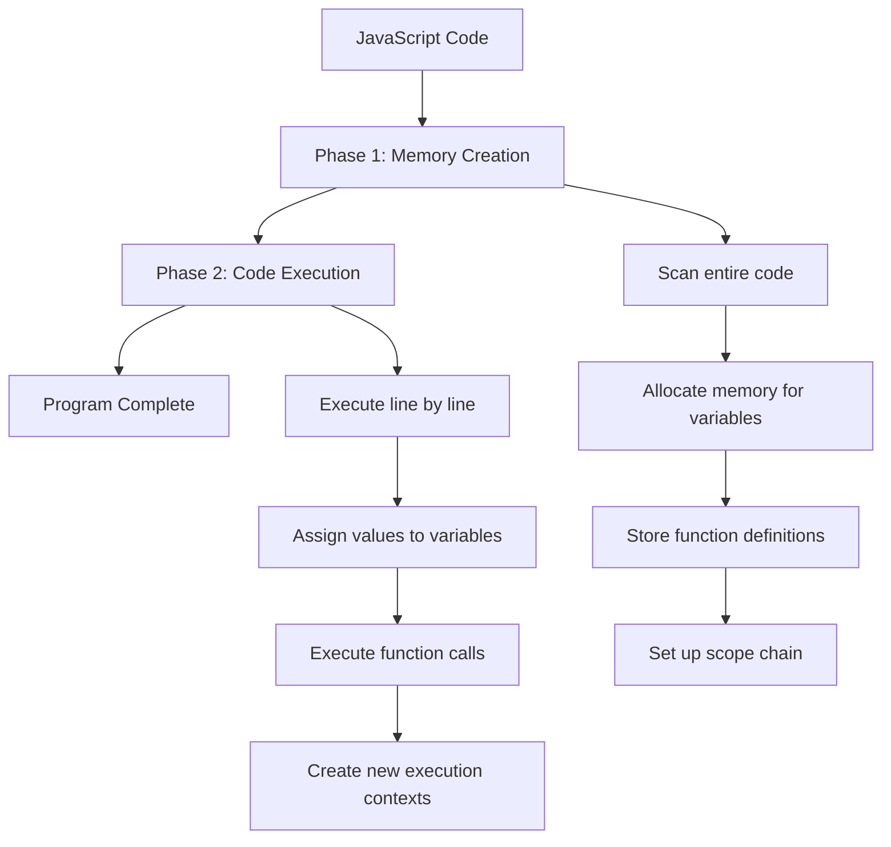
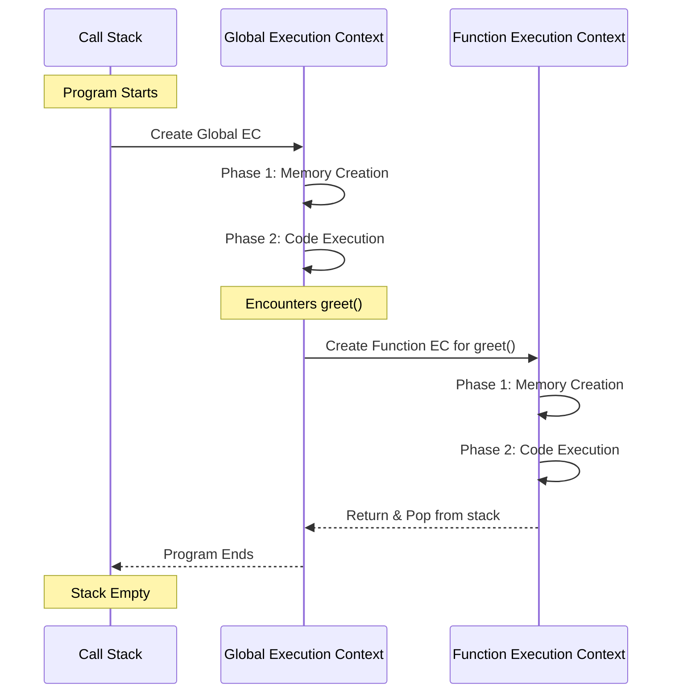

# 🧠 JavaScript Fundamentals

Essential JavaScript concepts for interview preparation.

---

## 1. Hoisting

**What is Hoisting?**
JavaScript's default behavior of moving declarations to the top of the current scope (function or global) during the compilation phase.

### Variable Hoisting

**`var` - Hoisted and initialized with `undefined`:**
```javascript
console.log(x); // undefined (not ReferenceError!)
var x = 5;
console.log(x); // 5

// What actually happens:
// var x;           // Declaration hoisted
// console.log(x);  // undefined
// x = 5;           // Assignment stays in place
```

**`let` and `const` - Hoisted but NOT initialized:**
```javascript
console.log(y); // ReferenceError: Cannot access 'y' before initialization
let y = 10;

console.log(z); // ReferenceError: Cannot access 'z' before initialization
const z = 20;
```

### Function Hoisting

**Function Declarations - Fully hoisted:**
```javascript
greet(); // "Hello!" - Works fine!

function greet() {
  console.log("Hello!");
}
```

**Function Expressions - NOT hoisted:**
```javascript
sayHi(); // TypeError: sayHi is not a function

var sayHi = function() {
  console.log("Hi!");
};

// What actually happens:
// var sayHi;           // Declaration hoisted (undefined)
// sayHi();             // Calling undefined() throws TypeError
// sayHi = function(){} // Assignment
```

**Arrow Functions - NOT hoisted:**
```javascript
hello(); // ReferenceError

const hello = () => console.log("Hello");
```

---

## 2. Temporal Dead Zone (TDZ)

**What is TDZ?**
The time between entering a scope and the variable being declared where you **cannot access** the variable.

```javascript
// TDZ starts here for 'x'
console.log(x); // ReferenceError: Cannot access 'x' before initialization

let x = 10; // TDZ ends here
console.log(x); // 10 - Now accessible
```

**Why does TDZ exist?**
- Catches bugs early (accessing variables before initialization)
- Makes code more predictable
- Prevents temporal coupling issues

**TDZ Example with `const`:**
```javascript
{
  // TDZ for 'name' starts
  console.log(name); // ReferenceError
  
  const name = "Alice"; // TDZ ends
  console.log(name); // "Alice"
}
```

**TDZ in function parameters:**
```javascript
function example(a = b, b = 2) {
  // ReferenceError: Cannot access 'b' before initialization
  // 'b' is in TDZ when used as default for 'a'
}
example();

// Fix: Reorder parameters
function fixed(b = 2, a = b) {
  console.log(a, b); // Works fine
}
fixed(); // 2, 2
```

**Key Point:** `var` has NO TDZ because it's initialized with `undefined` during hoisting.

---

## 3. Global Execution Context

**What is Execution Context?**
An environment where JavaScript code is evaluated and executed. It contains:
1. **Variable Environment** (variables, functions)
2. **Scope Chain** (access to outer scopes)
3. **`this` binding**

### Types of Execution Contexts

1. **Global Execution Context (GEC)**
   - Created when the script first runs
   - Only ONE per program
   - Creates global object (`window` in browser, `global` in Node.js)
   - Sets `this` to global object

2. **Function Execution Context (FEC)**
   - Created whenever a function is invoked
   - Can be many (one per function call)

3. **Eval Execution Context**
   - Created by `eval()` function (rarely used)

### Execution Context Phases

Every execution context goes through **two distinct phases**:

#### Phase 1: Memory Creation Phase (Hoisting Phase)
In this phase, JavaScript engine:
1. Scans the code **before execution**
2. Allocates memory for variables and functions
3. Sets up the scope chain
4. Determines `this` value

**What happens to different declarations:**
- `var` variables → Stored with value `undefined`
- `let`/`const` variables → Stored but **uninitialized** (TDZ begins)
- Function declarations → Stored with **entire function code**
- Function expressions → Only variable declaration hoisted (not the function)

#### Phase 2: Code Execution Phase
In this phase:
1. JavaScript executes code **line by line**
2. Assigns actual values to variables
3. Executes function calls
4. Creates new execution contexts for function calls

---

### Visual Breakdown: Two Phases



---

### Example: Step-by-Step Execution

```javascript
var name = "Alice";
var age = 25;

function greet() {
  console.log("Hello, " + name);
}

greet();
```

#### **Phase 1: Memory Creation Phase**

| Variable/Function | Memory Allocation |
|-------------------|------------------|
| `name` | `undefined` |
| `age` | `undefined` |
| `greet` | `function greet() { ... }` (entire function) |

**Memory looks like:**
```javascript
// Global Execution Context - Memory Phase
{
  name: undefined,
  age: undefined,
  greet: function greet() { console.log("Hello, " + name); }
}
```

#### **Phase 2: Code Execution Phase**

**Line by line execution:**

```javascript
// Line 1: var name = "Alice";
// Memory: { name: "Alice", age: undefined, greet: fn }

// Line 2: var age = 25;
// Memory: { name: "Alice", age: 25, greet: fn }

// Line 3-5: Function declaration (already in memory, skip)

// Line 7: greet();
// Create new Function Execution Context for greet()
// Output: "Hello, Alice"
// Return to Global Execution Context
```

---

### Complete Example with `let`/`const`

```javascript
console.log(x); // What happens here?
let x = 10;

var y = 20;
console.log(y);

function test() {
  return "Hello";
}
console.log(test());
```

#### **Phase 1: Memory Creation**

```javascript
// Global Execution Context - Memory
{
  x: <uninitialized> (TDZ starts),
  y: undefined,
  test: function test() { return "Hello"; }
}
```

#### **Phase 2: Code Execution**

```
Line 1: console.log(x)
→ ReferenceError! (x is in TDZ, uninitialized)

Line 2: let x = 10
→ x is now initialized with 10

Line 4: var y = 20
→ y = 20 (already had undefined, now assigned)

Line 5: console.log(y)
→ Output: 20

Line 7-9: Function declaration (skip, already processed)

Line 10: console.log(test())
→ Call test() → Create Function Execution Context
→ Return "Hello"
→ Output: "Hello"
```

---

### Call Stack Visualization



---

### Memory Snapshot Example

```javascript
var a = 10;
let b = 20;
const c = 30;

function multiply(x, y) {
  var result = x * y;
  return result;
}

var answer = multiply(5, 6);
```

**After Memory Creation Phase:**
```
Global Execution Context {
  Memory: {
    a: undefined
    b: <uninitialized>
    c: <uninitialized>
    multiply: function multiply(x, y) { ... }
    answer: undefined
  }
  Code: (waiting to execute)
}
```

**After Code Execution Phase:**
```
Global Execution Context {
  Memory: {
    a: 10
    b: 20
    c: 30
    multiply: function multiply(x, y) { ... }
    answer: 30
  }
  Code: (fully executed)
}

Function Execution Context (multiply) - POPPED
  Arguments: { x: 5, y: 6 }
  Memory: { result: 30 }
```

---

### Example: How Execution Context Works

```javascript
var name = "Global";

function outer() {
  var name = "Outer";
  
  function inner() {
    var name = "Inner";
    console.log(name); // "Inner" (current scope)
  }
  
  inner();
  console.log(name); // "Outer"
}

outer();
console.log(name); // "Global"

// Call Stack visualization:
// 3. inner() execution context
// 2. outer() execution context
// 1. Global execution context
```

### Global Execution Context in Detail

```javascript
// During CREATION phase:
// 1. Create global object (window/global)
// 2. Set 'this' to global object
// 3. Hoist 'greet' function
// 4. Hoist 'name' variable (initialized as undefined)

console.log(this); // Window (browser) or global (Node.js)
console.log(name); // undefined (hoisted but not assigned)
console.log(greet); // [Function: greet] (fully hoisted)

var name = "Alice";

function greet() {
  console.log("Hello, " + name);
}

// During EXECUTION phase:
// 1. Assign "Alice" to name
// 2. Execute function calls
greet(); // "Hello, Alice"
```

### Execution Context vs Scope

```javascript
var x = 10; // Global scope

function test() {
  var y = 20; // Function scope (local to test)
  
  console.log(x); // 10 (accesses global scope)
  console.log(y); // 20 (accesses local scope)
}

test();
console.log(x); // 10
console.log(y); // ReferenceError: y is not defined (not in global scope)
```

**Key Difference:**
- **Execution Context**: WHERE the code is executed (environment)
- **Scope**: WHICH variables you can ACCESS

---

## Quick Reference Table

| Concept | `var` | `let`/`const` |
|---------|-------|---------------|
| **Hoisting** | ✅ Hoisted + initialized (`undefined`) | ✅ Hoisted but NOT initialized |
| **TDZ** | ❌ No TDZ | ✅ Has TDZ |
| **Re-declaration** | ✅ Allowed | ❌ Not allowed |
| **Scope** | Function scope | Block scope |
| **Global Object** | Becomes property of `window` | Does NOT become property of `window` |

---

## Common Interview Questions

**Q1: What will this code output?**
```javascript
console.log(a);
var a = 5;
console.log(a);

// Answer: undefined, 5
```

**Q2: What will this code output?**
```javascript
greet();

function greet() {
  console.log("Hello");
}

var greet = function() {
  console.log("Hi");
};

// Answer: "Hello" (function declaration is hoisted, assignment happens later)
```

**Q3: Explain the error:**
```javascript
let x = 10;
{
  console.log(x); // ReferenceError
  let x = 20;
}

// Answer: TDZ - inner 'x' is hoisted to block scope but not initialized yet
```
