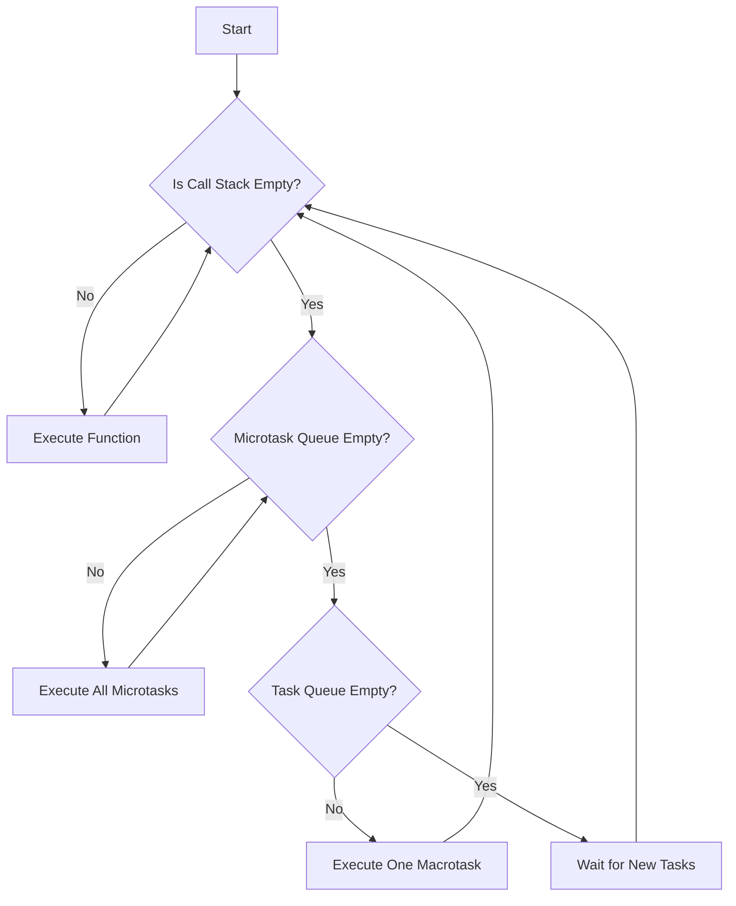

# 🧠 JavaScript Fundamentals

Essential JavaScript concepts for interview preparation.

---

## 1. Hoisting

**What is Hoisting?**
JavaScript's default behavior of moving declarations to the top of the current scope (function or global) during the compilation phase.

### Variable Hoisting

**`var` - Hoisted and initialized with `undefined`:**
```javascript
console.log(x); // undefined (not ReferenceError!)
var x = 5;
console.log(x); // 5

// What actually happens:
// var x;           // Declaration hoisted
// console.log(x);  // undefined
// x = 5;           // Assignment stays in place
```

**`let` and `const` - Hoisted but NOT initialized:**
```javascript
console.log(y); // ReferenceError: Cannot access 'y' before initialization
let y = 10;

console.log(z); // ReferenceError: Cannot access 'z' before initialization
const z = 20;
```

### Function Hoisting

**Function Declarations - Fully hoisted:**
```javascript
greet(); // "Hello!" - Works fine!

function greet() {
  console.log("Hello!");
}
```

**Function Expressions - NOT hoisted:**
```javascript
sayHi(); // TypeError: sayHi is not a function

var sayHi = function() {
  console.log("Hi!");
};

// What actually happens:
// var sayHi;           // Declaration hoisted (undefined)
// sayHi();             // Calling undefined() throws TypeError
// sayHi = function(){} // Assignment
```

**Arrow Functions - NOT hoisted:**
```javascript
hello(); // ReferenceError

const hello = () => console.log("Hello");
```

---

## 2. Temporal Dead Zone (TDZ)

**What is TDZ?**
The time between entering a scope and the variable being declared where you **cannot access** the variable.

```javascript
// TDZ starts here for 'x'
console.log(x); // ReferenceError: Cannot access 'x' before initialization

let x = 10; // TDZ ends here
console.log(x); // 10 - Now accessible
```

**Why does TDZ exist?**
- Catches bugs early (accessing variables before initialization)
- Makes code more predictable
- Prevents temporal coupling issues

**TDZ Example with `const`:**
```javascript
{
  // TDZ for 'name' starts
  console.log(name); // ReferenceError
  
  const name = "Alice"; // TDZ ends
  console.log(name); // "Alice"
}
```

**TDZ in function parameters:**
```javascript
function example(a = b, b = 2) {
  // ReferenceError: Cannot access 'b' before initialization
  // 'b' is in TDZ when used as default for 'a'
}
example();

// Fix: Reorder parameters
function fixed(b = 2, a = b) {
  console.log(a, b); // Works fine
}
fixed(); // 2, 2
```

**Key Point:** `var` has NO TDZ because it's initialized with `undefined` during hoisting.

---

## 3. Global Execution Context

**What is Execution Context?**
An environment where JavaScript code is evaluated and executed. It contains:
1. **Variable Environment** (variables, functions)
2. **Scope Chain** (access to outer scopes)
3. **`this` binding**

### Types of Execution Contexts

1. **Global Execution Context (GEC)**
   - Created when the script first runs
   - Only ONE per program
   - Creates global object (`window` in browser, `global` in Node.js)
   - Sets `this` to global object

2. **Function Execution Context (FEC)**
   - Created whenever a function is invoked
   - Can be many (one per function call)

3. **Eval Execution Context**
   - Created by `eval()` function (rarely used)

### Execution Context Phases

Every execution context goes through **two distinct phases**:

#### Phase 1: Memory Creation Phase (Hoisting Phase)
In this phase, JavaScript engine:
1. Scans the code **before execution**
2. Allocates memory for variables and functions
3. Sets up the scope chain
4. Determines `this` value

**What happens to different declarations:**
- `var` variables → Stored with value `undefined`
- `let`/`const` variables → Stored but **uninitialized** (TDZ begins)
- Function declarations → Stored with **entire function code**
- Function expressions → Only variable declaration hoisted (not the function)

#### Phase 2: Code Execution Phase
In this phase:
1. JavaScript executes code **line by line**
2. Assigns actual values to variables
3. Executes function calls
4. Creates new execution contexts for function calls

---

### Visual Breakdown: Two Phases


---

### Example: Step-by-Step Execution

```javascript
var name = "Alice";
var age = 25;

function greet() {
  console.log("Hello, " + name);
}

greet();
```

#### **Phase 1: Memory Creation Phase**

| Variable/Function | Memory Allocation |
|-------------------|------------------|
| `name` | `undefined` |
| `age` | `undefined` |
| `greet` | `function greet() { ... }` (entire function) |

**Memory looks like:**
```javascript
// Global Execution Context - Memory Phase
{
  name: undefined,
  age: undefined,
  greet: function greet() { console.log("Hello, " + name); }
}
```

#### **Phase 2: Code Execution Phase**

**Line by line execution:**

```javascript
// Line 1: var name = "Alice";
// Memory: { name: "Alice", age: undefined, greet: fn }

// Line 2: var age = 25;
// Memory: { name: "Alice", age: 25, greet: fn }

// Line 3-5: Function declaration (already in memory, skip)

// Line 7: greet();
// Create new Function Execution Context for greet()
// Output: "Hello, Alice"
// Return to Global Execution Context
```

---

### Complete Example with `let`/`const`

```javascript
console.log(x); // What happens here?
let x = 10;

var y = 20;
console.log(y);

function test() {
  return "Hello";
}
console.log(test());
```

#### **Phase 1: Memory Creation**

```javascript
// Global Execution Context - Memory
{
  x: <uninitialized> (TDZ starts),
  y: undefined,
  test: function test() { return "Hello"; }
}
```

#### **Phase 2: Code Execution**

```
Line 1: console.log(x)
→ ReferenceError! (x is in TDZ, uninitialized)

Line 2: let x = 10
→ x is now initialized with 10

Line 4: var y = 20
→ y = 20 (already had undefined, now assigned)

Line 5: console.log(y)
→ Output: 20

Line 7-9: Function declaration (skip, already processed)

Line 10: console.log(test())
→ Call test() → Create Function Execution Context
→ Return "Hello"
→ Output: "Hello"
```

---

### Call Stack Visualization


---

### Memory Snapshot Example

```javascript
var a = 10;
let b = 20;
const c = 30;

function multiply(x, y) {
  var result = x * y;
  return result;
}

var answer = multiply(5, 6);
```

**After Memory Creation Phase:**
```
Global Execution Context {
  Memory: {
    a: undefined
    b: <uninitialized>
    c: <uninitialized>
    multiply: function multiply(x, y) { ... }
    answer: undefined
  }
  Code: (waiting to execute)
}
```

**After Code Execution Phase:**
```
Global Execution Context {
  Memory: {
    a: 10
    b: 20
    c: 30
    multiply: function multiply(x, y) { ... }
    answer: 30
  }
  Code: (fully executed)
}

Function Execution Context (multiply) - POPPED
  Arguments: { x: 5, y: 6 }
  Memory: { result: 30 }
```

---

### Example: How Execution Context Works

```javascript
var name = "Global";

function outer() {
  var name = "Outer";
  
  function inner() {
    var name = "Inner";
    console.log(name); // "Inner" (current scope)
  }
  
  inner();
  console.log(name); // "Outer"
}

outer();
console.log(name); // "Global"

// Call Stack visualization:
// 3. inner() execution context
// 2. outer() execution context
// 1. Global execution context
```

### Global Execution Context in Detail

```javascript
// During CREATION phase:
// 1. Create global object (window/global)
// 2. Set 'this' to global object
// 3. Hoist 'greet' function
// 4. Hoist 'name' variable (initialized as undefined)

console.log(this); // Window (browser) or global (Node.js)
console.log(name); // undefined (hoisted but not assigned)
console.log(greet); // [Function: greet] (fully hoisted)

var name = "Alice";

function greet() {
  console.log("Hello, " + name);
}

// During EXECUTION phase:
// 1. Assign "Alice" to name
// 2. Execute function calls
greet(); // "Hello, Alice"
```

### Execution Context vs Scope

```javascript
var x = 10; // Global scope

function test() {
  var y = 20; // Function scope (local to test)
  
  console.log(x); // 10 (accesses global scope)
  console.log(y); // 20 (accesses local scope)
}

test();
console.log(x); // 10
console.log(y); // ReferenceError: y is not defined (not in global scope)
```

**Key Difference:**
- **Execution Context**: WHERE the code is executed (environment)
- **Scope**: WHICH variables you can ACCESS

---

## Quick Reference Table

| Concept | `var` | `let`/`const` |
|---------|-------|---------------|
| **Hoisting** | ✅ Hoisted + initialized (`undefined`) | ✅ Hoisted but NOT initialized |
| **TDZ** | ❌ No TDZ | ✅ Has TDZ |
| **Re-declaration** | ✅ Allowed | ❌ Not allowed |
| **Scope** | Function scope | Block scope |
| **Global Object** | Becomes property of `window` | Does NOT become property of `window` |

---

## Common Interview Questions

**Q1: What will this code output?**
```javascript
console.log(a);
var a = 5;
console.log(a);

// Answer: undefined, 5
```

**Q2: What will this code output?**
```javascript
greet();

function greet() {
  console.log("Hello");
}

var greet = function() {
  console.log("Hi");
};

// Answer: "Hello" (function declaration is hoisted, assignment happens later)
```

**Q3: Explain the error:**
```javascript
let x = 10;
{
  console.log(x); // ReferenceError
  let x = 20;
}

// Answer: TDZ - inner 'x' is hoisted to block scope but not initialized yet
```

---

## 4. Event Loop, Call Stack, Task Queue & Microtask Queue

### Understanding JavaScript's Asynchronous Execution Model

JavaScript is **single-threaded**, meaning it can execute only one piece of code at a time. However, it can handle asynchronous operations thanks to the **Event Loop** mechanism.

### Architecture Overview


---

### 1. Call Stack

**What is the Call Stack?**
- A **LIFO (Last In, First Out)** data structure that tracks function execution
- Keeps track of what function is currently running
- When a function is called, it's **pushed** onto the stack
- When a function returns, it's **popped** off the stack

**Example:**
```javascript
function first() {
  console.log("First");
  second();
  console.log("First again");
}

function second() {
  console.log("Second");
}

first();

// Call Stack Execution:
// 1. Push first() → Execute console.log("First")
// 2. Push second() → Execute console.log("Second")
// 3. Pop second() 
// 4. Continue first() → Execute console.log("First again")
// 5. Pop first()

// Output:
// First
// Second
// First again
```

---

### 2. Web APIs

**What are Web APIs?**
- Browser-provided APIs (not part of JavaScript engine)
- Handle asynchronous operations like:
  - `setTimeout` / `setInterval`
  - `fetch` / AJAX
  - DOM events
  - `Promise` resolution

When you call `setTimeout`, it's handled by the Web API, **not** the call stack.

---

### 3. Task Queue (Macro Task Queue)

**What is the Task Queue?**
- Also called **Callback Queue** or **Macro Task Queue**
- Stores callbacks from asynchronous operations
- **FIFO (First In, First Out)** structure

**What goes into Task Queue:**
- `setTimeout` callbacks
- `setInterval` callbacks
- `setImmediate` (Node.js)
- I/O operations
- UI rendering

**Example:**
```javascript
console.log("Start");

setTimeout(() => {
  console.log("Timeout");
}, 0);

console.log("End");

// Output:
// Start
// End
// Timeout

// Why? Even with 0ms delay, setTimeout callback goes to Task Queue
// and waits for call stack to be empty
```

---

### 4. Microtask Queue

**What is the Microtask Queue?**
- A **higher priority** queue than the Task Queue
- Processed **before** the next Task Queue item
- All microtasks are executed before any macrotask

**What goes into Microtask Queue:**
- `Promise.then()` / `Promise.catch()` / `Promise.finally()`
- `queueMicrotask()`
- `MutationObserver` callbacks
- `async/await` continuations

**Example:**
```javascript
console.log("Start");

setTimeout(() => {
  console.log("Timeout");
}, 0);

Promise.resolve().then(() => {
  console.log("Promise");
});

console.log("End");

// Output:
// Start
// End
// Promise
// Timeout

// Why? Microtask Queue (Promise) has higher priority than Task Queue (setTimeout)
```

---

### Event Loop Execution Flow



**Step-by-Step Process:**
1. **Execute synchronous code** from the call stack
2. When call stack is **empty**, check **Microtask Queue**
3. **Execute ALL microtasks** (one by one until queue is empty)
4. **Render UI** if needed (browser only)
5. Check **Task Queue**
6. Execute **ONE macrotask**
7. **Repeat** from step 2

---

### Priority: Microtask vs Macrotask

**🏆 Priority Order (Highest to Lowest):**
1. **Synchronous Code** (Call Stack)
2. **Microtasks** (Promises, queueMicrotask)
3. **Macrotasks** (setTimeout, setInterval)

**Key Rule:**
> **All microtasks are executed before the next macrotask**

---

### Comprehensive Example: Promises vs setTimeout

```javascript
console.log("1: Synchronous");

setTimeout(() => {
  console.log("2: setTimeout (Macrotask)");
}, 0);

Promise.resolve().then(() => {
  console.log("3: Promise 1 (Microtask)");
}).then(() => {
  console.log("4: Promise 2 (Microtask)");
});

setTimeout(() => {
  console.log("5: setTimeout 2 (Macrotask)");
}, 0);

Promise.resolve().then(() => {
  console.log("6: Promise 3 (Microtask)");
});

console.log("7: Synchronous End");

// Output:
// 1: Synchronous
// 7: Synchronous End
// 3: Promise 1 (Microtask)
// 4: Promise 2 (Microtask)
// 6: Promise 3 (Microtask)
// 2: setTimeout (Macrotask)
// 5: setTimeout 2 (Macrotask)
```

**Execution Breakdown:**

| Step | Action | Queue State |
|------|--------|-------------|
| 1 | Execute `console.log("1: Synchronous")` | Call Stack: [main] |
| 2 | `setTimeout` → Task Queue | Task Queue: [setTimeout 1] |
| 3 | `Promise.resolve().then()` → Microtask Queue | Microtask Queue: [Promise 1] |
| 4 | `setTimeout` → Task Queue | Task Queue: [setTimeout 1, setTimeout 2] |
| 5 | `Promise.resolve().then()` → Microtask Queue | Microtask Queue: [Promise 1, Promise 3] |
| 6 | Execute `console.log("7: Synchronous End")` | Call Stack: [main] |
| 7 | **Call Stack Empty** → Process Microtasks | Execute all microtasks |
| 8 | Execute Promise 1 (creates Promise 2) | Microtask Queue: [Promise 3, Promise 2] |
| 9 | Execute Promise 3 | Microtask Queue: [Promise 2] |
| 10 | Execute Promise 2 | Microtask Queue: [] |
| 11 | **Microtasks Empty** → Process Macrotasks | Execute ONE macrotask |
| 12 | Execute setTimeout 1 | Task Queue: [setTimeout 2] |
| 13 | **Back to Microtasks** (empty) | Execute next macrotask |
| 14 | Execute setTimeout 2 | Task Queue: [] |

---

### Complex Example: Nested Promises and setTimeout

```javascript
console.log("Start");

setTimeout(() => {
  console.log("Timeout 1");
  Promise.resolve().then(() => console.log("Promise inside Timeout 1"));
}, 0);

Promise.resolve().then(() => {
  console.log("Promise 1");
  setTimeout(() => console.log("Timeout inside Promise 1"), 0);
});

setTimeout(() => {
  console.log("Timeout 2");
}, 0);

Promise.resolve().then(() => {
  console.log("Promise 2");
});

console.log("End");

// Output:
// Start
// End
// Promise 1
// Promise 2
// Timeout 1
// Promise inside Timeout 1
// Timeout 2
// Timeout inside Promise 1
```

**Why this order?**

1. **Synchronous**: `Start`, `End`
2. **Microtasks (Promises)**: `Promise 1`, `Promise 2`
3. **First Macrotask**: `Timeout 1`
   - Creates new microtask → `Promise inside Timeout 1` (executed immediately)
4. **Second Macrotask**: `Timeout 2`
5. **Third Macrotask**: `Timeout inside Promise 1`

---

### Real-World Example: Async/Await

```javascript
console.log("1");

async function asyncFunc() {
  console.log("2");
  await Promise.resolve();
  console.log("3"); // This goes to Microtask Queue
}

asyncFunc();

console.log("4");

setTimeout(() => console.log("5"), 0);

Promise.resolve().then(() => console.log("6"));

console.log("7");

// Output:
// 1
// 2
// 4
// 7
// 3
// 6
// 5

// Explanation:
// - "await" pauses the function and puts the continuation (console.log("3")) in Microtask Queue
// - Microtasks (3, 6) execute before macrotasks (5)
```

---

### Microtask Starvation Example

**⚠️ Warning:** Continuously adding microtasks can **starve** macrotasks!

```javascript
console.log("Start");

setTimeout(() => {
  console.log("Timeout - This might never run!");
}, 0);

function addMicrotask() {
  Promise.resolve().then(() => {
    console.log("Microtask");
    addMicrotask(); // Recursively add microtasks
  });
}

addMicrotask();

// Output:
// Start
// Microtask
// Microtask
// Microtask
// ... (infinite loop, setTimeout never executes!)
```

**Why?** The event loop keeps executing microtasks and never gets to the macrotask queue!

---

### Event Loop Visual Summary

```mermaid
sequenceDiagram
    participant Code as JavaScript Code
    participant Stack as Call Stack
    participant WebAPI as Web APIs
    participant Micro as Microtask Queue
    participant Macro as Task Queue
    participant Loop as Event Loop
    
    Code->>Stack: Execute sync code
    Stack->>WebAPI: setTimeout(fn, 0)
    WebAPI->>Macro: Add callback to Task Queue
    
    Code->>Stack: Promise.resolve().then(fn)
    Stack->>Micro: Add callback to Microtask Queue
    
    Stack->>Loop: Call stack empty
    Loop->>Micro: Process ALL microtasks
    Micro->>Stack: Execute microtask
    Stack->>Loop: Microtasks done
    
    Loop->>Macro: Process ONE macrotask
    Macro->>Stack: Execute macrotask
    Stack->>Loop: Repeat cycle
```

---

### Quick Reference: Queue Priority

| Queue Type | Priority | Examples | Execution Rule |
|------------|----------|----------|----------------|
| **Call Stack** | 🥇 Highest | Synchronous code | Execute immediately |
| **Microtask Queue** | 🥈 High | Promises, `queueMicrotask`, `async/await` | Execute ALL before next macrotask |
| **Task Queue** | 🥉 Normal | `setTimeout`, `setInterval`, I/O | Execute ONE per event loop cycle |

---

### Interview Questions

**Q1: What will this code output?**
```javascript
console.log("A");
setTimeout(() => console.log("B"), 0);
Promise.resolve().then(() => console.log("C"));
console.log("D");

// Answer: A, D, C, B
// Explanation: Sync (A, D) → Microtask (C) → Macrotask (B)
```

**Q2: Explain the difference between Task Queue and Microtask Queue.**
```
Answer:
- Task Queue (Macrotask): setTimeout, setInterval, I/O
- Microtask Queue: Promises, queueMicrotask
- Priority: ALL microtasks execute before ANY macrotask
- Event loop processes all microtasks, then ONE macrotask, then repeat
```

**Q3: Why does Promise execute before setTimeout even with 0ms delay?**
```
Answer:
- setTimeout goes to Task Queue (macrotask)
- Promise goes to Microtask Queue
- Event loop priority: Microtasks > Macrotasks
- Even with 0ms, setTimeout waits for call stack to be empty AND all microtasks to complete
```
