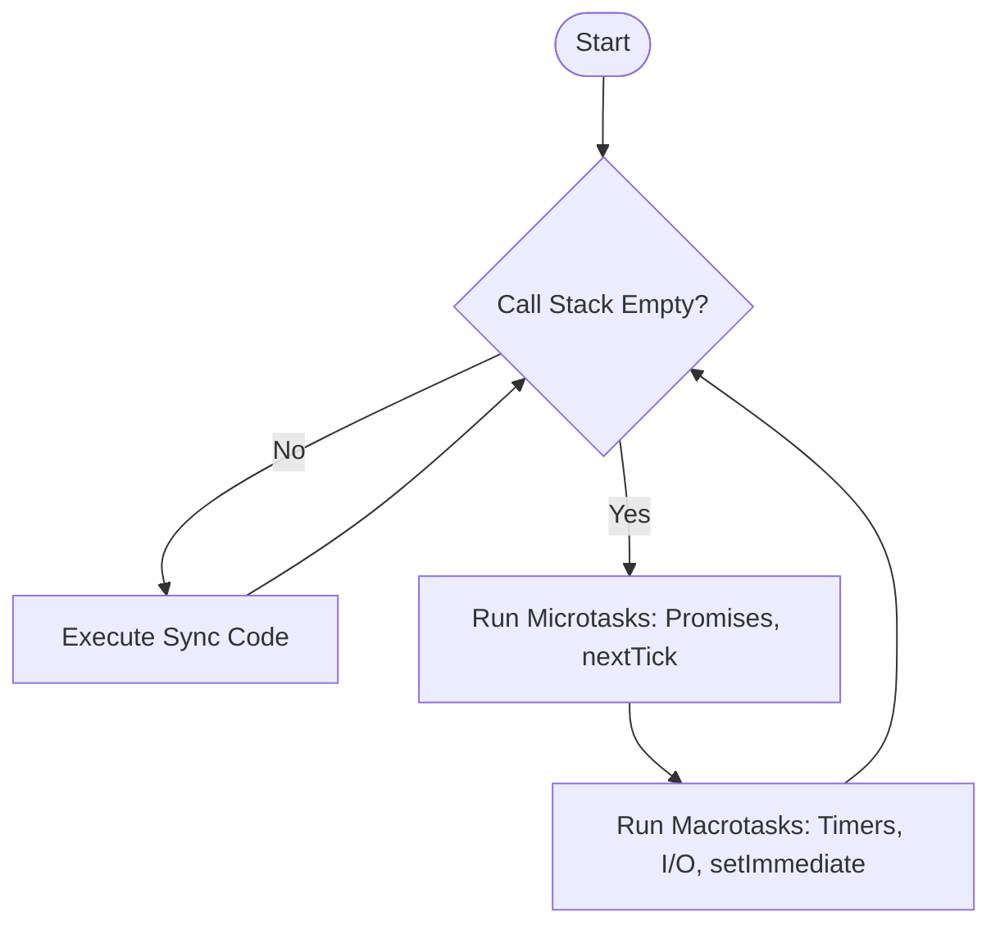

# 🟢 Node.js & Backend Interview Cheat Sheet

## 1. Core Concepts
- **Node.js:** A runtime environment for executing JavaScript server-side.
- **V8 Engine:** The Google Chrome engine that compiles JS to machine code.
- **Single-Threaded:** Uses a single main thread for execution but delegates I/O tasks to the system kernel (libuv).
- **Non-Blocking I/O:** Doesn't wait for file/network operations to finish; uses callbacks/promises to handle results later.

---

## 2. Node.js vs Browser - Key Differences

Both use JavaScript, but the **ecosystem** is completely different.

| Feature | Browser | Node.js |
| :--- | :--- | :--- |
| **Environment APIs** | DOM, `window`, `document`, Web APIs (fetch, localStorage, cookies) | File System, OS, Process, Network modules |
| **Version Control** | You **don't control** what browser users have | You **control** the exact Node.js version |
| **JavaScript Support** | Must support older browsers (need Babel/transpiling) | Can use latest ES2015+ features directly |
| **Module System** | ES Modules only (`import`/`export`) | Both CommonJS (`require`) and ES Modules (`import`) |
| **Use Case** | Frontend (UI, user interactions) | Backend (servers, APIs, CLI tools) |

### Practical Implications

**Browser:**
```javascript
// Browser-specific APIs
document.getElementById('btn').addEventListener('click', () => {});
localStorage.setItem('user', 'Alice');
fetch('/api/data').then(res => res.json());
```

**Node.js:**
```javascript
// Node.js-specific APIs
const fs = require('fs');
fs.readFile('file.txt', 'utf8', (err, data) => {});

const os = require('os');
console.log(os.platform()); // 'linux', 'win32', etc.
```

**Advantage:** Full-stack developers can use **one language** (JavaScript) for both frontend and backend, reducing context switching and leveraging the same skills across the entire stack.

---

## 2. The Event Loop (Crucial!)
The Event Loop is what allows Node.js to perform non-blocking I/O operations despite being single-threaded.

### Phases of the Event Loop
1. **Timers:** Executes `setTimeout()` and `setInterval()` callbacks.
2. **Pending Callbacks:** Executes I/O callbacks deferred to the next loop iteration.
3. **Idle, Prepare:** Internal use.
4. **Poll:** Retrieve new I/O events; execute I/O related callbacks.
5. **Check:** Executes `setImmediate()` callbacks.
6. **Close Callbacks:** e.g., `socket.on('close', ...)`.

### Diagram: Event Loop Execution Order


### Code Example: Execution Order
```javascript
console.log("1. Start");

setTimeout(() => {
    console.log("4. setTimeout (Macrotask)");
}, 0);

Promise.resolve().then(() => {
    console.log("3. Promise (Microtask)");
});

process.nextTick(() => {
    console.log("2. nextTick (High Priority Microtask)");
});

console.log("5. End");

// Output: 
// 1. Start
// 5. End
// 2. nextTick
// 3. Promise
// 4. setTimeout
```
> **Note:** `process.nextTick` has higher priority than Promises. Both run before `setTimeout`.

---

## 3. Express.js Basics
**Middleware:** Functions that have access to the request object (`req`), the response object (`res`), and the next middleware function (`next`).

### Types of Middleware
1. **Application-level:** `app.use((req, res, next) => ...)`
2. **Router-level:** `router.use(...)`
3. **Error-handling:** `app.use((err, req, res, next) => ...)` **(Must have 4 args)**
4. **Built-in:** `express.json()`, `express.static()`
5. **Third-party:** `morgan`, `cors`

### Example: Custom Logger Middleware
```javascript
const express = require('express');
const app = express();

function logger(req, res, next) {
    console.log(`${req.method} request to ${req.url}`);
    next(); // Pass control to the next handler
}

app.use(logger);

app.get('/', (req, res) => {
    res.send('Hello World');
});
```

---

## 4. Common Interview Questions

### Q1: `process.nextTick()` vs `setImmediate()`?
- **`process.nextTick()`**: Fires **immediately** after the current operation completes, *before* the Event Loop continues. It processes in the Microtask queue.
- **`setImmediate()`**: Fires in the **Check phase** of the Event Loop, *after* I/O events.

### Q2: CommonJS vs ES Modules?
- **CommonJS:** Uses `require()` and `module.exports`. Synchronous loading. (Default in Node.js < 14).
- **ES Modules:** Uses `import` and `export`. Asynchronous loading. (Standard in modern JS/Browsers).

### Q3: How do you handle errors in Async/Await?
Always use `try...catch` blocks.
```javascript
app.get('/users', async (req, res, next) => {
    try {
        const users = await db.getUsers();
        res.json(users);
    } catch (error) {
        next(error); // Pass to error handling middleware
    }
});
```

---

## 5. Advanced Node.js Concepts

### Streams
Process data piece by piece instead of loading everything into memory.

**Types:**
- **Readable**: Read data (file system, HTTP requests)
- **Writable**: Write data (file system, HTTP responses)
- **Duplex**: Both read and write (TCP sockets)
- **Transform**: Modify data while reading/writing (compression, encryption)

```javascript
const fs = require('fs');

// Bad: Loads entire file into memory
const data = fs.readFileSync('huge-file.txt', 'utf8');

// Good: Streams data in chunks
const readStream = fs.createReadStream('huge-file.txt');
readStream.pipe(process.stdout);

// Example: File processing with transform
const { Transform } = require('stream');

const upperCaseTransform = new Transform({
  transform(chunk, encoding, callback) {
    this.push(chunk.toString().toUpperCase());
    callback();
  }
});

fs.createReadStream('input.txt')
  .pipe(upperCaseTransform)
  .pipe(fs.createWriteStream('output.txt'));
```

**Use streams for:**
- Large files (videos, logs)
- Real-time data processing
- Memory efficiency (process data without loading all at once)

---

### Clustering
Utilize all CPU cores by creating worker processes.

```javascript
const cluster = require('cluster');
const os = require('os');
const express = require('express');

if (cluster.isMaster) {
  const numCPUs = os.cpus().length;
  console.log(`Master ${process.pid} is running`);
  
  // Fork workers
  for (let i = 0; i < numCPUs; i++) {
    cluster.fork();
  }
  
  cluster.on('exit', (worker, code, signal) => {
    console.log(`Worker ${worker.process.pid} died`);
    cluster.fork(); // Restart worker
  });
} else {
  const app = express();
  app.get('/', (req, res) => {
    res.send(`Handled by worker ${process.pid}`);
  });
  app.listen(3000);
  console.log(`Worker ${process.pid} started`);
}
```

**Benefits:**
- Maximizes CPU utilization
- Fault tolerance (worker crashes don't affect others)
- Zero-downtime restarts

---

### WebSockets
Full-duplex communication for real-time applications.

```javascript
// Server (using ws library)
const WebSocket = require('ws');
const wss = new WebSocket.Server({ port: 8080 });

wss.on('connection', (ws) => {
  console.log('Client connected');
  
  ws.on('message', (message) => {
    console.log('Received:', message);
    // Broadcast to all clients
    wss.clients.forEach((client) => {
      if (client.readyState === WebSocket.OPEN) {
        client.send(message);
      }
    });
  });
  
  ws.on('close', () => console.log('Client disconnected'));
});

// Client (browser)
const socket = new WebSocket('ws://localhost:8080');
socket.onopen = () => socket.send('Hello!');
socket.onmessage = (event) => console.log('Received:', event.data);
```

**Use cases:**
- Chat applications
- Live notifications
- Real-time dashboards
- Multiplayer games
- Live sports scores

---

### File Uploads (Multer)
Secure file upload handling.

```javascript
const multer = require('multer');
const path = require('path');
const crypto = require('crypto');

// Storage configuration
const storage = multer.diskStorage({
  destination: (req, file, cb) => {
    cb(null, 'uploads/');
  },
  filename: (req, file, cb) => {
    // Generate unique filename
    const uniqueName = crypto.randomBytes(16).toString('hex');
    cb(null, uniqueName + path.extname(file.originalname));
  }
});

// File filter for security
const fileFilter = (req, file, cb) => {
  const allowedTypes = /jpeg|jpg|png|pdf/;
  const extname = allowedTypes.test(path.extname(file.originalname).toLowerCase());
  const mimetype = allowedTypes.test(file.mimetype);
  
  if (mimetype && extname) {
    return cb(null, true);
  }
  cb(new Error('Only images and PDFs allowed'));
};

const upload = multer({ 
  storage,
  fileFilter,
  limits: { 
    fileSize: 5 * 1024 * 1024, // 5MB
    files: 5 // Max 5 files
  }
});

// Routes
app.post('/upload/single', upload.single('file'), (req, res) => {
  res.json({ file: req.file });
});

app.post('/upload/multiple', upload.array('files', 5), (req, res) => {
  res.json({ files: req.files });
});

// Error handling
app.use((error, req, res, next) => {
  if (error instanceof multer.MulterError) {
    if (error.code === 'LIMIT_FILE_SIZE') {
      return res.status(400).json({ error: 'File too large' });
    }
  }
  res.status(500).json({ error: error.message });
});
```

**Security Best Practices:**
- Validate file type (check MIME type AND extension)
- Limit file size
- Use random filenames
- Store outside public directory
- Scan for viruses (use antivirus API)
- Use cloud storage for production (AWS S3, Cloudinary)

---

### 🔗 Resources
- [Node.js Event Loop (Official Docs)](https://nodejs.org/en/docs/guides/event-loop-timers-and-nexttick/)
- [Don't Block the Event Loop](https://nodejs.org/en/docs/guides/dont-block-the-event-loop/)
