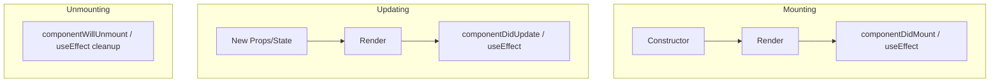
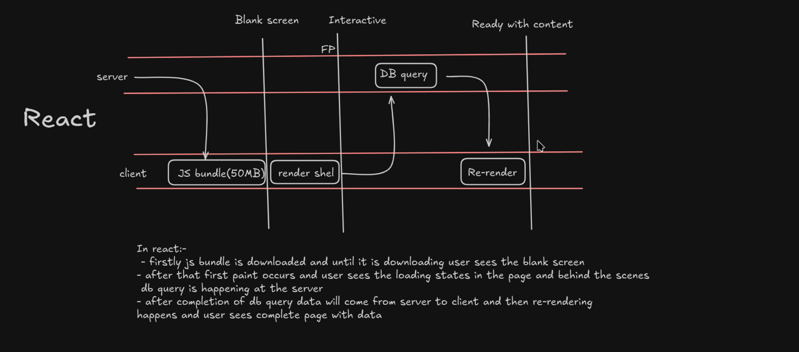
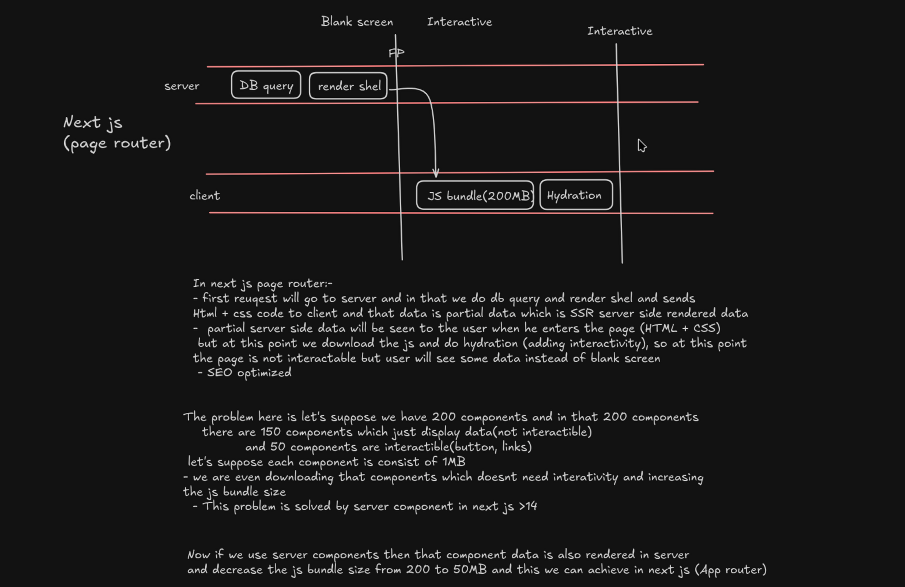

# ⚛️ React.js Interview Cheat Sheet

## 1. Core Concepts
- **Virtual DOM:** A lightweight copy of the real DOM. React compares the new V-DOM with the previous one (**Diffing**) and updates only changed elements (**Reconciliation**).
- **JSX:** Syntax extension for JS. Looks like HTML, but is JavaScript.
- **One-Way Data Flow:** Data flows down from parent to child via **props**.

---

## 2. Component Lifecycle
Understanding when things happen is key to avoiding bugs.

### Diagram: Lifecycle Phases


### Functional Components (Hooks)
| Phase | Class Component | Functional Hook Equivalent |
| :--- | :--- | :--- |
| **Mounting** | `componentDidMount` | `useEffect(() => { ... }, [])` |
| **Updating** | `componentDidUpdate` | `useEffect(() => { ... }, [dep])` |
| **Unmounting** | `componentWillUnmount` | `useEffect(() => { return () => { ... } }, [])` |

---

## 3. Important Hooks (Must Know)

### A. `useState`
Manages local state.
```javascript
const [count, setCount] = useState(0);
```

### B. `useEffect`
Handles side effects (API calls, subscriptions).
```javascript
useEffect(() => {
    console.log("Runs on mount and update");
    return () => console.log("Cleanup on unmount/re-run");
}, [dependency]); // Dependency Array controls execution
```

### C. `useMemo` vs `useCallback`
- **`useMemo`**: Caches a **calculated value**. Use for expensive calculations (just for optimizing values).
- **`useCallback`**: Caches a **function definition**. Use when passing functions to child components (to prevent child re-renders) (just for optimizing functions).

### D. `useRef`
Persists values between renders **without causing a re-render**. Also used to access DOM elements directly.

- React.memo prevents unnecessary re-renders of child components when props don’t change. 
- useMemo is used to cache expensive computed values
- useCallback is used to memoize function references so they aren’t recreated on every render, especially when passing callbacks to memoized components.

```
In useCallback If:

You don’t pass it to a memoized child

You don’t use it in a dependency array

👉 There is NO benefit
```

---

## 4. Common Interview Questions

### Q1: What is Prop Drilling? How to avoid it?
**Problem:** Passing data through many layers of components just to reach a deep child.
**Solution:**
1. **Context API:** For global state like Theme, User Auth.
2. **State Management Libraries:** Redux, Zustand, Recoil.
3. **Component Composition:** Passing components as children.

### Q2: Controlled vs Uncontrolled Components?
- **Controlled:** Form data is handled by React state (`value={state}`, `onChange={setState}`). **Recommended**.
- **Uncontrolled:** Form data is handled by the DOM (`ref`). Use for file inputs or integrating non-React libs.

### Q3: What is the "key" prop?
A unique string attribute that helps React identify which items have changed, added, or removed.
> **Warning:** Avoid using `index` as a key if the list order can change. Use unique IDs.

### Q4: React.memo?
A Higher Order Component (HOC) that skips re-rendering a component if its props haven't changed. Shallow comparison.

---

## 6. Advanced Topics

### `useState` vs `useReducer`
**When to use `useReducer`:**
- Complex state logic with multiple sub-values
- Next state depends on previous state
- Multiple ways to update state
- Need to pass dispatch to children (instead of multiple callbacks)

```javascript
const [state, dispatch] = useReducer(reducer, initialState);

function reducer(state, action) {
  switch (action.type) {
    case 'increment': return { count: state.count + 1 };
    case 'decrement': return { count: state.count - 1 };
    case 'reset': return initialState;
    default: return state;
  }
}

// Usage
dispatch({ type: 'increment' });
```

---

### Custom Hooks
Extract reusable stateful logic. Hook names must start with "use".

```javascript
// useFetch custom hook
function useFetch(url) {
  const [data, setData] = useState(null);
  const [loading, setLoading] = useState(true);
  const [error, setError] = useState(null);

  useEffect(() => {
    fetch(url)
      .then(res => res.json())
      .then(data => {
        setData(data);
        setLoading(false);
      })
      .catch(err => {
        setError(err);
        setLoading(false);
      });
  }, [url]);

  return { data, loading, error };
}

// Usage
function Component() {
  const { data, loading, error } = useFetch('/api/users');
  if (loading) return <div>Loading...</div>;
  if (error) return <div>Error: {error.message}</div>;
  return <div>{JSON.stringify(data)}</div>;
}
```

---

### Code Splitting & Lazy Loading
Split your bundle into smaller chunks loaded on-demand for better performance.

```javascript
// Without code splitting - all loaded at once
import HeavyComponent from './HeavyComponent';

// With code splitting - loaded when needed
const HeavyComponent = React.lazy(() => import('./HeavyComponent'));

function App() {
  return (
    <Suspense fallback={<div>Loading...</div>}>
      <HeavyComponent />
    </Suspense>
  );
}

// Route-based code splitting
const Home = lazy(() => import('./routes/Home'));
const About = lazy(() => import('./routes/About'));

function App() {
  return (
    <Router>
      <Suspense fallback={<div>Loading...</div>}>
        <Routes>
          <Route path="/" element={<Home />} />
          <Route path="/about" element={<About />} />
        </Routes>
      </Suspense>
    </Router>
  );
}
```

---

### Error Boundaries
Catch JavaScript errors anywhere in component tree and display fallback UI.

```javascript
class ErrorBoundary extends React.Component {
  constructor(props) {
    super(props);
    this.state = { hasError: false, error: null };
  }

  static getDerivedStateFromError(error) {
    return { hasError: true, error };
  }

  componentDidCatch(error, errorInfo) {
    // Log to error reporting service
    console.error('Error caught:', error, errorInfo);
  }

  render() {
    if (this.state.hasError) {
      return (
        <div>
          <h1>Something went wrong.</h1>
          <details>
            <summary>Error details</summary>
            <pre>{this.state.error?.toString()}</pre>
          </details>
        </div>
      );
    }
    return this.props.children;
  }
}

// Usage
<ErrorBoundary>
  <MyApp />
</ErrorBoundary>
```

**Error boundaries don't catch:**
- Errors in event handlers (use try-catch)
- Asynchronous code (setTimeout, promises)
- Server-side rendering errors
- Errors in the error boundary itself

--- 

### Controlled vs Uncontrolled Components

- **Controlled:** Form data is handled by React state (`value={state}`, `onChange={setState}`). **Recommended**.
- **Uncontrolled:** Form data is handled by the DOM (`ref`). Use for file inputs or integrating non-React libs.

Controlled components are React inputs whose value is managed by React state, while uncontrolled components store their value in the DOM and are accessed using refs.

---

## Lifting State Up

Lifting state up in React means moving shared state to the closest common parent component so that multiple child components can access and update it through props. It is necessary to maintain a single source of truth and keep the UI in sync.

### why ??

Because in React:
- Data flows one-way (parent → child)
- Sibling components cannot talk directly to each other

So if:
- Two or more components need the same data
- Or one component needs to change data used by another

Lift the state up to the nearest common parent.

<details>
<summary>
  Solution: Lift state up 
</summary>

#### Step 1: Move state to parent
```
import { useState } from "react";

function Parent() {
  const [value, setValue] = useState("");

  return (
    <>
      <ChildA value={value} onChange={setValue} />
      <ChildB value={value} />
    </>
  );
}
```

#### Step 2: Pass data and updater via props
```
function ChildA({ value, onChange }) {
  return (
    <input
      value={value}
      onChange={(e) => onChange(e.target.value)}
    />
  );
}

function ChildB({ value }) {
  return <p>{value}</p>;
}
```
</details>

---

### Rules of Hooks

1. Only call hooks at the top level. Don't call hooks inside loops, conditions, or nested functions.
2. Only call hooks from React function components and custom hooks. Don't call hooks from regular functions (e.g., plain JavaScript functions, event handlers, or lifecycle methods).
3. Call hooks in the same order on every render. Don't conditionally call hooks or call hooks inside loops.

## Key differences between useEffect and useLayoutEffect

### Timing
useEffect: Executes after the browser has painted the UI. \
useLayoutEffect: Executes before the browser paints, right after DOM changes.

### Blocking behavior
useEffect: Non-blocking, runs asynchronously. \
useLayoutEffect: Blocking, runs synchronously.

### Use case examples
useEffect: Fetching data, updating state, or adding event listeners. \
useLayoutEffect: Measuring DOM elements, managing animations, or solving layout issues.

---

### higher-order components (HOCs)
Higher order components (HOCs) are functions in React that take a component as an argument and return a new component. The new component typically wraps the original component and adds additional props, state, or behavior. HOCs are a pattern for reusing component logic.

---

### Lazy Loading
Code splitting is a performance optimization technique that involves breaking down your application's code into smaller, more manageable chunks. This allows the application to load only the necessary code initially and defer the loading of other parts until they are needed. This can significantly reduce the initial load time and improve the overall user experience.

<details>
<summary>Lazy Loading in react</summary>

```javascript
import {lazy,Suspense} from 'react';
const MyComponent = React.lazy(() => import('./MyComponent'));

function App() {
  return (
    <React.Suspense fallback={<div>Loading...</div>}>
      <MyComponent />
    </React.Suspense>
  );
}
```
</details>

<details>
<summary>Lazy Loading in Next.js</summary>

```javascript
import dynamic from "next/dynamic";

const Chart = dynamic(() => import("./Chart"), {
  loading: () => <p>Loading...</p>,
  ssr: false,
});
```
</details>

---

### Suspense and fallback

Suspense is a React component that lets you show a temporary UI while something is loading.  \
That “something” can be:
- Lazy-loaded components
- Data (in modern React / Next.js)
- Server Components streaming

fallback is the UI shown while React is waiting for the component or data to load.

<details>
<summary>Lazy Loading in react</summary>

```javascript
import { lazy, Suspense } from "react";

const Profile = lazy(() => import("./Profile"));

function App() {
  return (
    <Suspense fallback={<p>Loading profile...</p>}>
      <Profile />
    </Suspense>
  );
}
```
</details>

<details>
<summary>Suspense in Next.js</summary>

```javascript
import { Suspense } from "react";

export default function Page() {
  return (
    <Suspense fallback={<p>Loading data...</p>}>
      <Posts />
    </Suspense>
  );
}
```
</details>

---

##  What is Hydration?

**Hydration** is the process where React **attaches JavaScript behavior** (event listeners, state) to **HTML already rendered on the server**.

In simple words:
- Server sends ready HTML
- Browser shows it instantly
- React makes it interactive

Hydration happens **after SSR (Server-Side Rendering)**.

---

## Why does Hydration occur?

Hydration occurs because of **Server-Side Rendering (SSR)**.

Without hydration:
- Page looks correct
- Buttons don’t work
- No interactivity

With hydration:
- Clicks work
- State works
- App becomes interactive

SSR = Fast first load  
Hydration = Interactivity

---

## Hydration Flow (Step-by-Step)

```text
1. Server renders HTML (SSR)
2. Browser displays HTML immediately
3. JavaScript bundle downloads
4. React hydrates the HTML
5. App becomes interactive
```
## Hydration mismatch
When server-rendered HTML ≠ client-rendered HTML

### Common Causes
- Using browser-only APIs during SSR              (window.innerWidth, document.title, localStorage)
- Non-deterministic values                        (e.g., timestamps, random numbers)
- Conditional rendering based on client-only data (if (typeof window !== "undefined") { ... })

### How to prevent hydration issues 
1. Use Client Components when needed
```
"use client";
```
2. Run browser-only code inside useEffect
```
useEffect(() => {
  setWidth(window.innerWidth);
}, []);
```

3. Disable SSR for specific components (Next.js)
```
import dynamic from "next/dynamic";

const Chart = dynamic(() => import("./Chart"), {
  ssr: false
});
```

4. Use deterministic rendering on server
```
Bad:

<p>{Math.random()}</p>

Good:

<p>{valueFromServer}</p>
```

5. Use suppressHydrationWarning (last resort)
```
<p suppressHydrationWarning>
  {new Date().toLocaleTimeString()}
</p>
```

## client side rendering


## server side rendering

