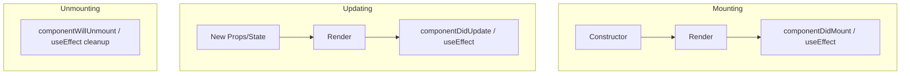

# ⚛️ React.js Interview Cheat Sheet

## 1. Core Concepts
- **Virtual DOM:** A lightweight copy of the real DOM. React compares the new V-DOM with the previous one (**Diffing**) and updates only changed elements (**Reconciliation**).
- **JSX:** Syntax extension for JS. Looks like HTML, but is JavaScript.
- **One-Way Data Flow:** Data flows down from parent to child via **props**.

---

## 2. Component Lifecycle
Understanding when things happen is key to avoiding bugs.

### Diagram: Lifecycle Phases


### Functional Components (Hooks)
| Phase | Class Component | Functional Hook Equivalent |
| :--- | :--- | :--- |
| **Mounting** | `componentDidMount` | `useEffect(() => { ... }, [])` |
| **Updating** | `componentDidUpdate` | `useEffect(() => { ... }, [dep])` |
| **Unmounting** | `componentWillUnmount` | `useEffect(() => { return () => { ... } }, [])` |

---

## 3. Important Hooks (Must Know)

### A. `useState`
Manages local state.
```javascript
const [count, setCount] = useState(0);
```

### B. `useEffect`
Handles side effects (API calls, subscriptions).
```javascript
useEffect(() => {
    console.log("Runs on mount and update");
    return () => console.log("Cleanup on unmount/re-run");
}, [dependency]); // Dependency Array controls execution
```

### C. `useMemo` vs `useCallback`
- **`useMemo`**: Caches a **calculated value**. Use for expensive calculations.
- **`useCallback`**: Caches a **function definition**. Use when passing functions to child components (to prevent child re-renders).

### D. `useRef`
Persists values between renders **without causing a re-render**. Also used to access DOM elements directly.

---

## 4. Common Interview Questions

### Q1: What is Prop Drilling? How to avoid it?
**Problem:** Passing data through many layers of components just to reach a deep child.
**Solution:**
1. **Context API:** For global state like Theme, User Auth.
2. **State Management Libraries:** Redux, Zustand, Recoil.
3. **Component Composition:** Passing components as children.

### Q2: Controlled vs Uncontrolled Components?
- **Controlled:** Form data is handled by React state (`value={state}`, `onChange={setState}`). **Recommended**.
- **Uncontrolled:** Form data is handled by the DOM (`ref`). Use for file inputs or integrating non-React libs.

### Q3: What is the "key" prop?
A unique string attribute that helps React identify which items have changed, added, or removed.
> **Warning:** Avoid using `index` as a key if the list order can change. Use unique IDs.

### Q4: React.memo?
A Higher Order Component (HOC) that skips re-rendering a component if its props haven't changed. Shallow comparison.

---

## 5. Context API Example (Global State)
```javascript
const ThemeContext = React.createContext('light');

function App() {
    return (
        <ThemeContext.Provider value="dark">
            <Toolbar />
        </ThemeContext.Provider>
    );
}

function Toolbar() {
    return <ThemedButton />;
}

function ThemedButton() {
    // Consuming the context
    const theme = React.useContext(ThemeContext);
    return <button style={{ background: theme === 'dark' ? '#333' : '#fff' }}>I am {theme}</button>;
}
```

---

## 6. Advanced Topics

### `useState` vs `useReducer`
**When to use `useReducer`:**
- Complex state logic with multiple sub-values
- Next state depends on previous state
- Multiple ways to update state
- Need to pass dispatch to children (instead of multiple callbacks)

```javascript
const [state, dispatch] = useReducer(reducer, initialState);

function reducer(state, action) {
  switch (action.type) {
    case 'increment': return { count: state.count + 1 };
    case 'decrement': return { count: state.count - 1 };
    case 'reset': return initialState;
    default: return state;
  }
}

// Usage
dispatch({ type: 'increment' });
```

---

### Custom Hooks
Extract reusable stateful logic. Hook names must start with "use".

```javascript
// useFetch custom hook
function useFetch(url) {
  const [data, setData] = useState(null);
  const [loading, setLoading] = useState(true);
  const [error, setError] = useState(null);

  useEffect(() => {
    fetch(url)
      .then(res => res.json())
      .then(data => {
        setData(data);
        setLoading(false);
      })
      .catch(err => {
        setError(err);
        setLoading(false);
      });
  }, [url]);

  return { data, loading, error };
}

// Usage
function Component() {
  const { data, loading, error } = useFetch('/api/users');
  if (loading) return <div>Loading...</div>;
  if (error) return <div>Error: {error.message}</div>;
  return <div>{JSON.stringify(data)}</div>;
}
```

---

### Code Splitting & Lazy Loading
Split your bundle into smaller chunks loaded on-demand for better performance.

```javascript
// Without code splitting - all loaded at once
import HeavyComponent from './HeavyComponent';

// With code splitting - loaded when needed
const HeavyComponent = React.lazy(() => import('./HeavyComponent'));

function App() {
  return (
    <Suspense fallback={<div>Loading...</div>}>
      <HeavyComponent />
    </Suspense>
  );
}

// Route-based code splitting
const Home = lazy(() => import('./routes/Home'));
const About = lazy(() => import('./routes/About'));

function App() {
  return (
    <Router>
      <Suspense fallback={<div>Loading...</div>}>
        <Routes>
          <Route path="/" element={<Home />} />
          <Route path="/about" element={<About />} />
        </Routes>
      </Suspense>
    </Router>
  );
}
```

---

### Error Boundaries
Catch JavaScript errors anywhere in component tree and display fallback UI.

```javascript
class ErrorBoundary extends React.Component {
  constructor(props) {
    super(props);
    this.state = { hasError: false, error: null };
  }

  static getDerivedStateFromError(error) {
    return { hasError: true, error };
  }

  componentDidCatch(error, errorInfo) {
    // Log to error reporting service
    console.error('Error caught:', error, errorInfo);
  }

  render() {
    if (this.state.hasError) {
      return (
        <div>
          <h1>Something went wrong.</h1>
          <details>
            <summary>Error details</summary>
            <pre>{this.state.error?.toString()}</pre>
          </details>
        </div>
      );
    }
    return this.props.children;
  }
}

// Usage
<ErrorBoundary>
  <MyApp />
</ErrorBoundary>
```

**Error boundaries don't catch:**
- Errors in event handlers (use try-catch)
- Asynchronous code (setTimeout, promises)
- Server-side rendering errors
- Errors in the error boundary itself

---

### 🔗 Resources
- [React Official Docs (New)](https://react.dev/)
- [Overreacted.io (Dan Abramov's Blog)](https://overreacted.io/)
