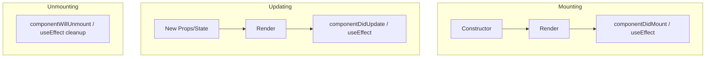

# ⚛️ React.js Interview Cheat Sheet

## 1. Core Concepts
- **Virtual DOM:** A lightweight copy of the real DOM. React compares the new V-DOM with the previous one (**Diffing**) and updates only changed elements (**Reconciliation**).
- **JSX:** Syntax extension for JS. Looks like HTML, but is JavaScript.
- **One-Way Data Flow:** Data flows down from parent to child via **props**.

---

## 2. Component Lifecycle
Understanding when things happen is key to avoiding bugs.

### Diagram: Lifecycle Phases


### Functional Components (Hooks)
| Phase | Class Component | Functional Hook Equivalent |
| :--- | :--- | :--- |
| **Mounting** | `componentDidMount` | `useEffect(() => { ... }, [])` |
| **Updating** | `componentDidUpdate` | `useEffect(() => { ... }, [dep])` |
| **Unmounting** | `componentWillUnmount` | `useEffect(() => { return () => { ... } }, [])` |

---

## 3. Important Hooks (Must Know)

### A. `useState`
Manages local state.
```javascript
const [count, setCount] = useState(0);
```

### B. `useEffect`
Handles side effects (API calls, subscriptions).
```javascript
useEffect(() => {
    console.log("Runs on mount and update");
    return () => console.log("Cleanup on unmount/re-run");
}, [dependency]); // Dependency Array controls execution
```

### C. `useMemo` vs `useCallback`
- **`useMemo`**: Caches a **calculated value**. Use for expensive calculations.
- **`useCallback`**: Caches a **function definition**. Use when passing functions to child components (to prevent child re-renders).

### D. `useRef`
Persists values between renders **without causing a re-render**. Also used to access DOM elements directly.

---

## 4. Common Interview Questions

### Q1: What is Prop Drilling? How to avoid it?
**Problem:** Passing data through many layers of components just to reach a deep child.
**Solution:**
1. **Context API:** For global state like Theme, User Auth.
2. **State Management Libraries:** Redux, Zustand, Recoil.
3. **Component Composition:** Passing components as children.

### Q2: Controlled vs Uncontrolled Components?
- **Controlled:** Form data is handled by React state (`value={state}`, `onChange={setState}`). **Recommended**.
- **Uncontrolled:** Form data is handled by the DOM (`ref`). Use for file inputs or integrating non-React libs.

### Q3: What is the "key" prop?
A unique string attribute that helps React identify which items have changed, added, or removed.
> **Warning:** Avoid using `index` as a key if the list order can change. Use unique IDs.

### Q4: React.memo?
A Higher Order Component (HOC) that skips re-rendering a component if its props haven't changed. Shallow comparison.

---

## 5. Context API Example (Global State)
```javascript
const ThemeContext = React.createContext('light');

function App() {
    return (
        <ThemeContext.Provider value="dark">
            <Toolbar />
        </ThemeContext.Provider>
    );
}

function Toolbar() {
    return <ThemedButton />;
}

function ThemedButton() {
    // Consuming the context
    const theme = React.useContext(ThemeContext);
    return <button style={{ background: theme === 'dark' ? '#333' : '#fff' }}>I am {theme}</button>;
}
```

### 🔗 Resources
- [React Official Docs (New)](https://react.dev/)
- [Overreacted.io (Dan Abramov's Blog)](https://overreacted.io/)
